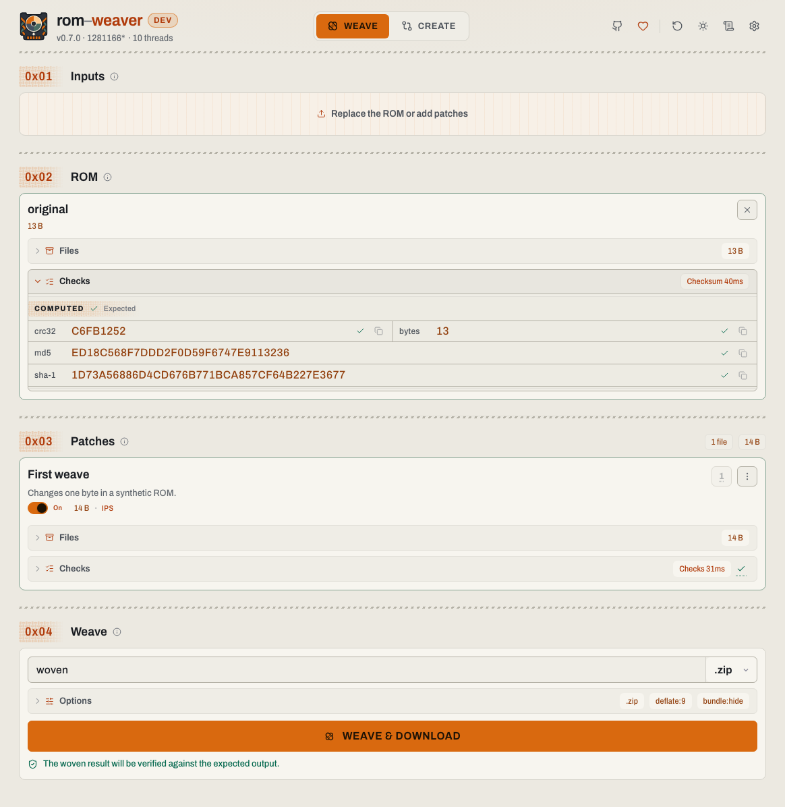
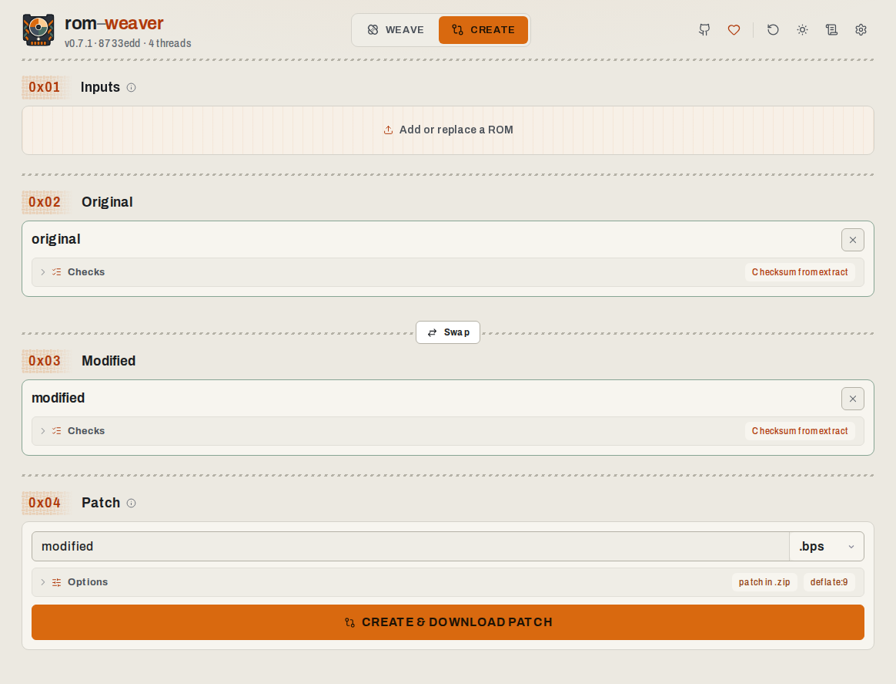
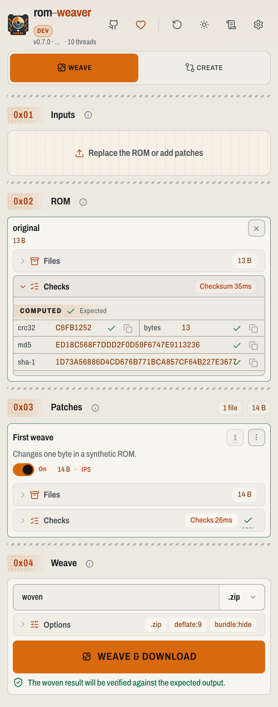
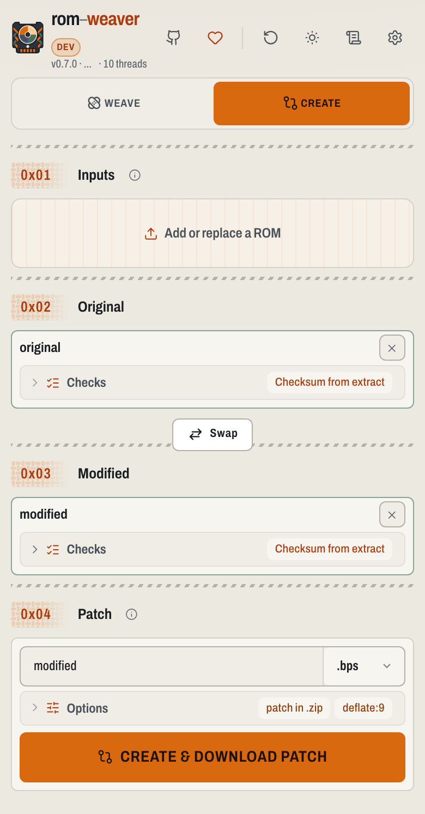

<h1 align="center"> rom-weaver</h1>

<p align="center">
  A local-first offline toolkit for ROMs and ROM hack patches. Inspect, extract, checksum, compress, trim, apply patches, create patches, or bundle shareable patch manifests at native speed. In your browser or terminal.
</p>

<p align="center">
  <a href="https://github.com/brandonocasey/rom-weaver/releases/latest"></a>
  <a href="package.json"></a>
  <a href=".mise.toml"></a>
  <a href="LICENSE.md"></a>
</p>

<p align="center">
 <a href="https://rom-weaver.com/">Open the webapp</a>
 · <a href="#screenshots">Screenshots</a>
 · <a href="#install">Install</a>
 · <a href="docs/README.md">Documentation</a>
 · <a href="https://ko-fi.com/brandonocasey">Support on Ko-fi</a>
</p>

<!-- START doctoc -->
## Table of contents

- [Features](#features)
- [Notices](#notices)
  - [Beta status](#beta-status)
  - [LLM-assisted development](#llm-assisted-development)
- [Install](#install)
  - [Webapp](#webapp)
  - [CLI](#cli)
  - [Self-host the webapp](#self-host-the-webapp)
- [Screenshots](#screenshots)
  - [Desktop](#desktop)
    - [Apply patches (Weave)](#apply-patches-weave)
    - [Create a patch](#create-a-patch)
  - [Mobile](#mobile)
    - [Apply patches (Weave)](#apply-patches-weave-1)
    - [Create a patch](#create-a-patch-1)
- [Documentation](#documentation)
- [Contributing and support](#contributing-and-support)
- [License](#license)

<!-- END doctoc -->

## Features

- **Apply and create patches.** IPS, BPS, UPS, xdelta/VCDIFF, PPF, RUP,
  BSDIFF40, APS, DCP (Dreamcast), and more than twenty formats in total, with
  ordered multi-patch chains, strict checksum validation, and cheat-code
  baking.
- **Inspect and extract containers.** ZIP, 7z, RAR, the tar family, CHD, RVZ,
  Z3DS, CSO, PBP, GCZ, WIA, WBFS, and more, including nested archives.
- **Create compressed containers.** ZIP, 7z, CHD, RVZ, and Z3DS with
  codec-aware compression settings, validated against reference tools such as
  chdman and dolphin-tool.
- **Checksum and verify.** CRC32, MD5, SHA-1, SHA-256, BLAKE3, and friends,
  with copier-header detection, header repair, and header-aware checksum
  variants.
- **Trim and restore.** Reversible trimming for NDS, GBA, 3DS, and XISO with
  an opt-in revert footer that restores the original file byte-for-byte.
- **Share workflows.** Distributable [`rom-weaver-bundle.json`](docs/rom-weaver-bundle.schema.json)
  bundles pin patch order, checksums, and output naming so others can replay
  the exact workflow.
- **Local-first and private.** Everything runs on your machine. The webapp is
  an installable PWA that works offline and never uploads your files.
- **One engine, two frontends.** The same Rust core powers the terminal CLI
  and the threaded WASM webapp, with line-delimited JSON output for scripting.

The complete format, codec, and checksum compatibility tables are maintained
in the [CLI guide](docs/cli.md#supported-formats).

## Notices

### Beta status

rom-weaver is beta software and follows Semantic Versioning, but until v1.0,
breaking changes may still happen between minor releases. Patching,
compressing, extracting, and bundling have all been tested extensively. If you
rely on the APIs or CLI flags, expect things to be a bit tougher: those
interfaces may still change as the project heads toward v1.0.

### LLM-assisted development

rom-weaver is built by a full-time software engineer in my spare time. Claude
and ChatGPT are used during development for brainstorming, implementation,
debugging, and review. I make the engineering decisions and review and test
the resulting work myself; the goal is high-quality, dependable software, but
AI-assisted code may still need extra scrutiny.

## Install

### Webapp

Open the hosted webapp at **[rom-weaver.com](https://rom-weaver.com/)**. There
is nothing to install and no account: choose **Weave**, add a ROM and one or
more patches, review the detected formats and checksums, then run the workflow
and save the result. Use **Create** to generate a distributable patch from
an original and a modified file; optional Trim and Tools workflows can be
enabled in the webapp settings. Your files are processed locally and never
leave the device. Install it as a PWA from the browser menu to use it offline.
New here? [Try the sample weave](https://rom-weaver.com/?bundle=first-weave.zip#/weave)
with tiny synthetic files.

To run the webapp on your own infrastructure, see
[Self-host the webapp](#self-host-the-webapp) below.

### CLI

The CLI needs no runtime beyond the install method you pick. Every method
below installs the same `rom-weaver` command; run `rom-weaver --help` to
verify it, then run the [first weave](docs/cli.md#first-weave).

<details>
<summary><strong>npx</strong> — run once without installing (Node.js 22+)</summary>

```bash
npx --yes @rom-weaver/cli --help
```

Downloads the native binary for the current platform on first use.

</details>

<details>
<summary><strong>npm</strong> — global install (Node.js 22+)</summary>

```bash
npm install --global @rom-weaver/cli
rom-weaver --help
```

The npm packages ship prebuilt binaries for macOS arm64/x64, Linux x64
(glibc), and Windows x64. On Unix, the generated `rom-weaver(1)` man pages are
installed when npm's global man directory is on `MANPATH`.

</details>

<details>
<summary><strong>cargo binstall</strong> — install the prebuilt release binary</summary>

Install [cargo-binstall](https://github.com/cargo-bins/cargo-binstall) once,
then download the matching native binary from the GitHub release:

```bash
cargo binstall --no-confirm rom-weaver-cli
rom-weaver --help
```

This uses the release binary for macOS arm64/x64, Linux x64 glibc, and Windows
x64 MSVC; it does not compile from source. Other targets should use the Cargo
source install below.

</details>

<details>
<summary><strong>Cargo</strong> — build from crates.io</summary>

```bash
cargo install rom-weaver-cli
rom-weaver --help
```

Builds from source, so it works on any supported Rust target beyond the
prebuilt npm platforms. Requires Rust 1.95+, CMake, Clang, and a native
compiler toolchain.

</details>

<details>
<summary><strong>Cargo</strong> — build a tagged release from Git</summary>

```bash
cargo install \
  --git https://github.com/brandonocasey/rom-weaver.git \
  --tag v0.5.0 \
  rom-weaver-cli
rom-weaver --help
```

Same toolchain requirements as the crates.io install. Useful for pinning an
exact tag or testing an unreleased branch (drop `--tag` for the default
branch).

</details>

<details>
<summary><strong>Docker</strong> — published CLI image</summary>

```bash
docker run --rm ghcr.io/brandonocasey/rom-weaver-cli:latest --help
```

Mount a working directory to process local files:

```bash
docker run --rm --volume "$PWD:/data" \
  ghcr.io/brandonocasey/rom-weaver-cli:latest \
  probe --input /data/game.sfc
```

</details>

<details>
<summary><strong>From source</strong> — run a development checkout</summary>

```bash
git clone --recurse-submodules https://github.com/brandonocasey/rom-weaver.git
cd rom-weaver
cargo run --release -p rom-weaver-cli -- --help
```

Requires Rust 1.95+, CMake, Clang, and a native compiler toolchain. The
[development guide](docs/development.md) covers the full toolchain setup,
webapp builds, and tests.

</details>

### Self-host the webapp

Each method serves the full webapp — WASM build, cross-origin isolation
headers, SPA fallback, and precompressed assets included. The
[self-hosting guide](docs/self-hosting.md) covers reverse proxies, subpath
routing, service-worker scope, and the required COOP/COEP headers.

<details>
<summary><strong>Docker</strong> — published webapp image</summary>

```bash
docker run --rm --publish 8080:8080 ghcr.io/brandonocasey/rom-weaver-webapp:latest
curl --fail --silent --show-error http://localhost:8080/health
```

Open `http://localhost:8080/`. For production, put the container behind an
HTTPS reverse proxy.

</details>

<details>
<summary><strong>Docker Compose</strong> — build the image from a checkout</summary>

```bash
git clone --recurse-submodules https://github.com/brandonocasey/rom-weaver.git
cd rom-weaver
docker compose up --build --detach
curl --fail --silent --show-error http://localhost:8080/health
```

Only Docker with Compose is required; the image installs its own build
toolchains. Set `PORT` to change the host port, for example
`PORT=3000 docker compose up --build --detach`.

</details>

<details>
<summary><strong>Static hosting</strong> — download and upload the compiled webapp</summary>

Download the compiled static bundle from the most recent [GitHub
release](https://github.com/brandonocasey/rom-weaver/releases/latest), then
extract it into the directory your HTTPS static host serves:

```bash
mkdir -p /path/to/rom-weaver
curl --fail --location --show-error \
  https://github.com/brandonocasey/rom-weaver/releases/latest/download/rom-weaver-webapp.tar.gz \
  | tar --extract --gzip --directory /path/to/rom-weaver
```

Replace `/path/to/rom-weaver` with your document root. The host must support
SPA fallback and the required COOP/COEP/CORP headers; see
[static files](docs/self-hosting.md#static-files) for host configuration.

</details>

## Screenshots

### Desktop

#### Apply patches (Weave)

<picture>
  <source media="(prefers-color-scheme: dark)" srcset="packages/rom-weaver-webapp/design/weave-desktop-dark.png">
  
</picture>

#### Create a patch

<picture>
  <source media="(prefers-color-scheme: dark)" srcset="packages/rom-weaver-webapp/design/create-desktop-dark.png">
  
</picture>

### Mobile

#### Apply patches (Weave)

<picture>
  <source media="(prefers-color-scheme: dark)" srcset="packages/rom-weaver-webapp/design/weave-mobile-dark.png">
  
</picture>

#### Create a patch

<picture>
  <source media="(prefers-color-scheme: dark)" srcset="packages/rom-weaver-webapp/design/create-mobile-dark.png">
  
</picture>

## Documentation

The [documentation index](docs/README.md) routes to the CLI, deployment,
integration, development, architecture, and format-reference guides.

## Contributing and support

Bug reports and contributions are welcome. Read the
[contribution guide](.github/CONTRIBUTING.md) and [code of conduct](.github/CODE_OF_CONDUCT.md)
before submitting a change, and report
suspected vulnerabilities through the private channel in the
[security policy](.github/SECURITY.md). If rom-weaver has been useful to you, you can
support continued development on [Ko-fi](https://ko-fi.com/brandonocasey).

## License

Copyright (C) Brandon Casey

See [LICENSE.md](LICENSE.md) for the license terms. Bundled third-party
components retain their own licenses. Release builds include a generated
`NOTICE`, `THIRD_PARTY_LICENSES.md`, and corresponding license texts.
