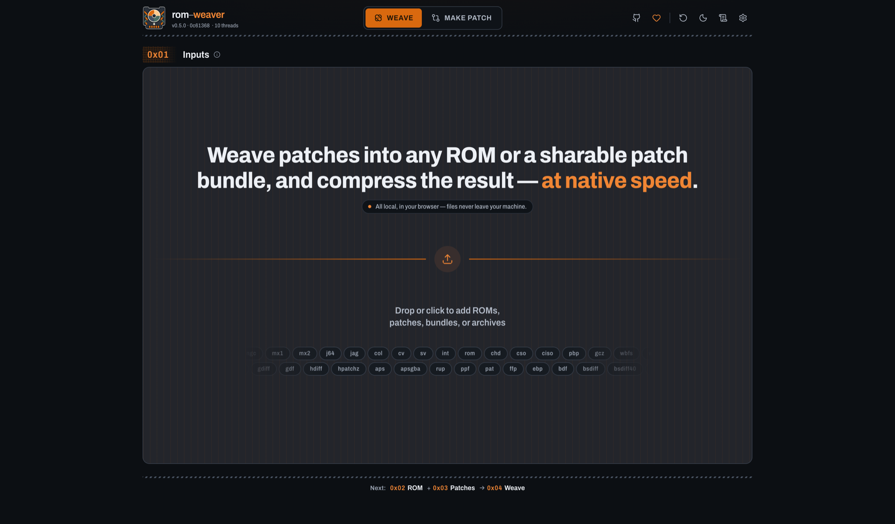

<p align="center">
  
</p>

<h1 align="center"> rom-weaver</h1>

<p align="center">
  A local-first offline toolkit for ROMs and ROM hack patches. Inspect, extract, checksum, compress, trim, apply patches, create patches, or bundle shareable patch manifests at native speed. In your browser or terminal.
</p>

<p align="center">
  <a href="https://github.com/brandonocasey/rom-weaver/releases/latest"></a>
  <a href="package.json"></a>
  <a href=".mise.toml"></a>
  <a href="LICENSE.md"></a>
</p>

<p align="center">
 <a href="https://rom-weaver.com/">Open the webapp</a>
 · <a href="docs/README.md">Documentation</a>
 · <a href="https://ko-fi.com/brandonocasey">Support on Ko-fi</a>
</p>

rom-weaver can inspect, extract, checksum, compress, trim, patch, and create
patches for many cartridge and disc formats. The browser app processes files
locally with WebAssembly; the native CLI exposes the same command core for
scripts and terminal workflows.

## Install

### Prerequisites

The hosted webapp needs only a supported browser. The CLI needs Node.js 22+
for npm or `npx`, or Rust 1.95+, CMake, Clang, and a native compiler
toolchain for Cargo.

Building the webapp from source additionally needs `mise`, the WASI SDK,
Brotli, and `sccache`. `mise` installs the pinned Rust, Node.js, Binaryen,
and ripgrep versions used by the repository; it does not install the WASI SDK
or system packages. On macOS with Homebrew:

```bash
brew install mise cmake llvm brotli sccache
```

On other systems, install [mise](https://mise.jdx.dev/) with your package
manager or its installer, then run `mise install` and `mise trust`. See the
[development prerequisites](docs/development.md#prerequisites) for WASI SDK
locations and platform-specific setup. Docker users need Docker with Compose;
the webapp image contains the build toolchains.

### Webapp

Use the [rom-weaver webapp](https://rom-weaver.com/) in a browser. No
installation or account is required. To run it on your own infrastructure, see
[Start here](#start-here) below.

### CLI

Choose the installation or execution method that fits your workflow:

```bash
# One-off use with Node.js 22+
npx --yes rom-weaver --help

# Install the native platform package with npm
npm install --global rom-weaver
rom-weaver --help

# Install the published Rust crate
cargo install rom-weaver-cli
rom-weaver --help

# Run from a source checkout
git clone --recurse-submodules https://github.com/brandonocasey/rom-weaver.git
cd rom-weaver
cargo run --release -p rom-weaver-cli -- --help

# Run the published CLI container
docker run --rm ghcr.io/brandonocasey/rom-weaver-cli:latest --help
```

The npm packages provide macOS arm64/x64, Linux x64 glibc, and Windows x64
binaries. Cargo builds for other supported Rust targets. The [CLI guide](docs/cli.md)
covers command behavior, supported formats, compression codecs, checksums, and
JSON output.

## Start here

### Use the webapp

Open the [hosted webapp](https://rom-weaver.com/).
No installation or account is required.

1. Choose **Weave** to add a ROM or disc image and one or more patch files.
2. Review the detected formats, checksums, patch order, and output settings.
3. Run the workflow and save the result.

Use **Make Patch** to compare an original file with a modified file and create
a distributable patch. Optional Trim and Tools workflows can be enabled in the
webapp settings.

### Use the CLI

Get started without installing:

```bash
npx rom-weaver --help
```

Or install the current tagged native CLI from source:

```bash
cargo install \
  --git https://github.com/brandonocasey/rom-weaver.git \
  --tag v0.5.0 \
  rom-weaver-cli
rom-weaver --help
```

Common commands:

```bash
# Identify a file or the payload inside a container
rom-weaver probe game.sfc

# Apply a patch and write an uncompressed ROM
rom-weaver patch apply \
  --input game.sfc \
  --patch translation.bps \
  --output game-translated.sfc \
  --no-compress

# Create a BPS patch
rom-weaver patch create \
  --original original.sfc \
  --modified modified.sfc \
  --format bps \
  --output release.bps

# Extract and checksum files
rom-weaver extract collection.7z --out-dir extracted
rom-weaver checksum game.sfc --algo sha256
```

See the [CLI guide](docs/cli.md) for installation alternatives, command
behavior, supported formats, compression codecs, checksums, and JSON output.

### Self-host with Docker

Run the published webapp image:

```bash
docker run --rm --publish 8080:8080 ghcr.io/brandonocasey/rom-weaver-webapp:latest
curl --fail --silent --show-error http://localhost:8080/health
```

Or build the webapp from a checkout with Docker Compose:

```bash
docker compose up --build --detach
curl --fail --silent --show-error http://localhost:8080/health
```

Open `http://localhost:8080/`. The container includes the WASM build,
cross-origin isolation headers, SPA fallback, and precompressed Brotli assets.
For production, put it behind an HTTPS reverse proxy. Set `PORT` to use a
different local port, for example `PORT=3000 docker compose up --build --detach`.

### Static hosting

Build the static directory from a checkout. This requires `mise`, a WASI SDK,
and Brotli; the [development guide](docs/development.md) lists platform
prerequisites. If `mise` is not installed, its upstream installer is:

```bash
curl https://mise.run | sh
```

Then build:

```bash
git clone --recurse-submodules https://github.com/brandonocasey/rom-weaver.git
cd rom-weaver
mise install
mise trust
npm ci --prefix packages/rom-weaver-webapp
mise run build-wasm-prod
npm --prefix packages/rom-weaver-webapp run build
```

Upload `packages/rom-weaver-webapp/dist/` to an HTTPS static host that supports
SPA fallback and the required COOP/COEP/CORP headers. The [self-hosting guide](docs/self-hosting.md)
covers reverse proxies, subpath routing, service-worker scope, and static-host
configuration.

## What it supports

- Patch apply and creation for IPS, BPS, UPS, xdelta/VCDIFF, PPF, RUP,
  BSDIFF40, DCP, and many other formats.
- Container inspection and extraction for ZIP, 7z, RAR, tar-family archives,
  CHD, RVZ, Z3DS, CSO, PBP, GCZ, WIA, WBFS, and more.
- ZIP, 7z, CHD, RVZ, and Z3DS creation with codec-aware compression settings.
- CRC, MD5, SHA, BLAKE3, ROM-header detection, checksum repair, and reversible
  trimming for supported systems.
- Ordered, shareable workflows through `rom-weaver-bundle.json` bundles.

The complete compatibility tables are maintained in the
[CLI guide](docs/cli.md#supported-formats).

## Develop

Clone the repository with its submodules, then install the pinned toolchains
and JavaScript dependencies:

```bash
git clone --recurse-submodules https://github.com/brandonocasey/rom-weaver.git
cd rom-weaver
mise install
mise trust
npm ci
npm ci --prefix packages/rom-weaver-webapp
mise run build-wasm
npm run dev
```

The WASM build also needs WASI SDK and Brotli. See the
[development guide](docs/development.md) for prerequisites, native CLI builds,
browser tests, worktrees, and the full `mise run ci` quality gate.

## Documentation

Start with the [documentation index](docs/README.md), or jump directly to:

- [CLI usage and supported formats](docs/cli.md)
- [Self-hosting and Docker](docs/self-hosting.md)
- [Webapp integration API](docs/self-hosting.md#ingesting-existing-opfs-files)
- [Webapp URL API](docs/ARCHITECTURE.md#rom-weaver-bundlejson-bundles)
- [Development and testing](docs/development.md)
- [Architecture](docs/ARCHITECTURE.md)
- [Runtime configuration](docs/env-vars.md)

Format specifications and reference implementations are collected in
[`docs/references.md`](docs/references.md).

## Contributing and support

Bug reports and contributions are welcome. Read the
[contribution guide](.github/CONTRIBUTING.md) and [code of conduct](.github/CODE_OF_CONDUCT.md)
before submitting a change, and report
suspected vulnerabilities through the private channel in the
[security policy](.github/SECURITY.md). If rom-weaver has been useful to you, you can
support continued development on [Ko-fi](https://ko-fi.com/brandonocasey).

## License

Copyright (C) Brandon Casey

See [LICENSE.md](LICENSE.md) for the license terms. Bundled third-party
components retain their own licenses. Release builds include a generated
`NOTICE`, `THIRD_PARTY_LICENSES.md`, and corresponding license texts.
