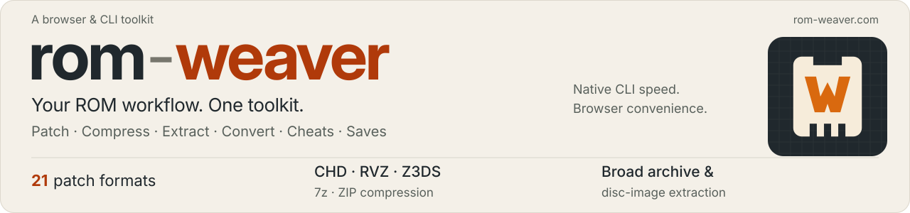

<p align="center">
  <a href="https://rom-weaver.com">
    <picture>
      <source media="(max-width: 600px) and (prefers-color-scheme: dark)" srcset="packages/rom-weaver-webapp/design/readme-banner-mobile-dark.svg">
      <source media="(max-width: 600px)" srcset="packages/rom-weaver-webapp/design/readme-banner-mobile.svg">
      <source media="(prefers-color-scheme: dark)" srcset="packages/rom-weaver-webapp/design/readme-banner-dark.svg">
      
    </picture>
  </a>
</p>

Apply ROM hacks and translations, convert disc images, bake in cheat codes, and edit supported game saves. Play supported games in the browser with EmulatorJS.

Works offline in your browser or CLI. Your files stay on your device. No telemetry.

<p>
  <a href="https://rom-weaver.com/apply-patch"></a>
  <a href="https://github.com/sponsors/brandonocasey"></a>
  <a href="https://ko-fi.com/brandonocasey"></a>
  <a href="https://www.npmjs.com/package/rom-weaver"></a>
  <a href="https://crates.io/crates/rom-weaver-cli"></a>
  <a href="https://github.com/orgs/rom-weaver/packages/container/package/rom-weaver-cli"></a>
  <a href="https://github.com/rom-weaver/homebrew-tap"></a>
  <a href="https://github.com/rom-weaver/rom-weaver/actions/workflows/ci.yml"></a>
  <a href="package.json"></a>
  <a href=".config/mise.toml"></a>
  <a href="LICENSE"></a>
</p>

<details>
<summary>Contents</summary>

<!-- START doctoc -->

- [Install](#install)
- [Webapp](#webapp)
- [Self-hosting](#self-hosting)
- [CLI](#cli)
- [Why](#why)
- [Performance](#performance)
- [Features](#features)
- [Notices](#notices)
- [Screenshots](#screenshots)
- [Documentation](#documentation)
- [Contributing and support](#contributing-and-support)
- [License](#license)

<!-- END doctoc -->

</details>

## Install

Choose the [webapp](#webapp), [self-hosting](#self-hosting), or [CLI](#cli) path below.

## Webapp

Open [rom-weaver.com/apply-patch](https://rom-weaver.com/apply-patch). Add your ROM and patches, then download the result. Files are processed on your device. No install or account is needed.

For offline use, first cache the app and any needed identify packs, cheat databases, and emulator cores. Remote files still need a connection. See [offline behavior](docs/explanation/local-first.md#offline) and [privacy](docs/legal/privacy.md).

Start with [your first patch](docs/tutorials/first-patch.md) to practise on supplied homebrew files. The [browser guides](docs/README.md#in-the-browser) cover applying, creating, bundling, and testing ROM patches.

## Self-hosting

Use the published Docker image or static release archive. The [self-hosting guide](docs/hosting/self-hosting.md) covers both, including HTTPS, reverse proxies, and subpaths.

## CLI

Native release assets cover macOS arm64 and x86-64; Linux x86-64 GNU plus x86-64, arm64, and i686 musl; and Windows arm64, x86-64, and x86.

Three recommended ways to install:

```bash
brew install rom-weaver/tap/rom-weaver
```

```bash
curl --proto '=https' --tlsv1.2 -LsSf \
  https://raw.githubusercontent.com/rom-weaver/rom-weaver/main/install.sh | sh
```

```bash
npm install --global rom-weaver
```


Homebrew covers macOS arm64/Intel and Linux arm64/x86-64. The install script covers macOS and Linux: it downloads the latest release to `~/.local/bin` and checks its build provenance, refusing a definite verification failure. If the check cannot run, it warns and continues unless strict verification is enabled; see [Verify a download](docs/how-to/verify-downloads.md). npm is the only channel covering every supported target at once, and needs Node.js 22+.

<a name="build-from-source"></a>

Windows, Scoop, PowerShell, cargo-binstall, mise, Docker, shell completions, and building from source are all in [Install the CLI](./docs/how-to/install-cli.md).

All three methods above carry the identify and cheat databases, so they need no extra step. Methods that install only the executable - `cargo install`, `cargo binstall`, and `mise` - need `rom-weaver setup` afterwards to download that data, which `identify`, `probe --identify`, and cheat baking read.

Hitting `Permission denied`? See [File permissions](./docs/reference/cli.md#file-permissions).

The [development guide](./docs/development/development.md) covers the full toolchain setup, webapp builds, and tests.

## Why

A patch job can require extraction, several patches in order, checksum checks, and compression. rom-weaver runs those steps together and can save the recipe as a bundle.

[Browser and CLI](docs/explanation/browser-and-cli.md) explains the two interfaces. [Comparison with similar tools](docs/explanation/comparisons.md) covers alternatives.

## Performance

The [performance guide](docs/development/performance.md) records measured compression and extraction times, output sizes, hardware, and test settings. Results vary by format and input; some compression cases are slower than the reference tool.

The CLI and browser share one Rust engine. Browser workers and storage add costs, so native timings do not predict browser performance.

## Features

- **Apply and create patches.** Twenty-one formats, including IPS, BPS, UPS, xdelta/VCDIFF, PPF, RUP, BDF/BSDIFF40, APS, and DCP (Dreamcast), with ordered multi-patch chains, checksum validation when the format or bundle supplies expected values, and cheat-code baking. Three of them (DCP, BSP, and HDiffPatch) can only be applied, not created.
- **Play and test in the browser.** Run supported games with EmulatorJS, including patched output. Keep game saves and save states in browser storage, and import or export them. See [browser testing](docs/how-to/test-roms-in-browser.md) and [supported platforms](docs/reference/formats.md#browser-emulator-support).
- **Use cheat codes.** Select codes from the built-in database or enter your own. Bake supported ROM cheats into a game or export them as a patch. Codes that require runtime memory writes cannot be baked. See [browser cheats](docs/how-to/use-browser-cheats.md).
- **Edit supported game saves.** The beta Save Editor inspects and edits supported fields, validates checksums, and writes an edited copy. Game and layout support is specific; emulator save states are not editable game saves. See the [Save Editor reference](docs/reference/save-editor.md) and [CLI save guide](docs/how-to/cli-save.md).
- **Inspect and extract containers.** ZIP, 7z, RAR, the tar family, CHD, RVZ, Z3DS, CSO, PBP, GCZ, WIA, WBFS, and more, including nested archives.
- **Create format-specific compressed containers.** ZIP, 7z, CHD, RVZ, and Z3DS with codec-aware compression settings. CHD and RVZ outputs are checked for round-trip compatibility with chdman and dolphin-tool.
- **Checksum and verify.** CRC32, MD5, SHA-1, SHA-256, BLAKE3, and friends, with copier-header detection, header repair, and header-aware checksum variants.
- **Trim and restore.** Trimming for NDS, GBA, 3DS, XISO, and RVZ scrub. NDS, GBA, and 3DS can be padded back out. An optional footer records the original length and one padding byte; exact restoration has [limits](docs/how-to/cli-trim.md#make-the-trim-reversible).
- **Share workflows.** Distributable [`rom-weaver-bundle.json`](./docs/rom-weaver-bundle-v2.schema.json) bundles pin patch order, checksums, and output naming so others can replay the exact workflow.
- **Local-first and private.** Everything runs on your machine. The webapp is an installable PWA that works offline with cached assets. Your files are never uploaded, and rom-weaver sends no telemetry.
- **One engine, two frontends.** The same Rust core powers the terminal CLI and the threaded WASM webapp. CLI operation commands can emit line-delimited JSON for scripting.

The complete format, codec, and checksum compatibility tables are maintained in [Supported formats](./docs/reference/formats.md).

## Notices

### Beta status

rom-weaver is beta software and follows Semantic Versioning, but until v1.0, breaking changes may still happen between minor releases. Patching, compressing, extracting, and bundling are covered by automated tests. Hands-on testing happens on macOS and Linux; Windows is covered by hosted CI but has seen much less real-world use, so expect rougher edges there and please report anything Windows-specific. If you rely on the APIs or CLI flags, expect things to be a bit tougher: those interfaces may still change as the project heads toward v1.0. Trim and Tools are still beta, so they are disabled by default in the webapp and can be enabled in Settings. The `rom-weaver-core`, `-checksum`, `-containers`, and `-patches` crates are published to crates.io only so `rom-weaver-cli` can use them. The CLI and the webapp are the supported interfaces; using those crates as libraries in another project is not supported.

### First complete public release

v0.7.2 was the first complete public release. The changelog and the git history go back further, but v0.6.0 through v0.7.1 failed partway through the release pipeline or were only partially published. v0.7.1 completed most of the pipeline, but it still missed the crates.io CLI package, shipped a broken unscoped npm launcher, and built the static webapp archive with mismatched release metadata. Starting with v0.7.2, all public install methods were intended to work together. Install commands above resolve the current release unless you explicitly pin a version.

### LLM-assisted development

rom-weaver is built by a full-time software engineer in my spare time. Claude and ChatGPT are used during development for brainstorming, implementation, debugging, and review. I make the engineering decisions and review and test the resulting work myself; the goal is high-quality, dependable software, but AI-assisted code may still need extra scrutiny.

### Translations

Localized translations are early and may be entirely wrong in places. Manual edits and corrections are welcome.

## Screenshots

[View every screenshot at full size.](./docs/development/screenshots.md)

<table>
  <thead>
    <tr>
      <th scope="col">Name</th>
      <th scope="col">Screenshot</th>
    </tr>
  </thead>
  <tbody>
    <tr>
      <td>Desktop: ordered patch stack</td>
      <td>
        <picture>
          <source media="(prefers-color-scheme: dark)" srcset="docs/screenshots/apply-patches-desktop-dark.webp">
          
        </picture>
      </td>
    </tr>
    <tr>
      <td>Desktop: create output</td>
      <td>
        <picture>
          <source media="(prefers-color-scheme: dark)" srcset="docs/screenshots/create-output-desktop-dark.webp">
          
        </picture>
      </td>
    </tr>
    <tr>
      <td>Mobile: Original and Modified</td>
      <td align="center">
        <picture>
          <source media="(prefers-color-scheme: dark)" srcset="docs/screenshots/create-inputs-mobile-dark.webp">
          
        </picture>
      </td>
    </tr>
    <tr>
      <td>Mobile: bundle output options</td>
      <td align="center">
        <picture>
          <source media="(prefers-color-scheme: dark)" srcset="docs/screenshots/bundle-output-mobile-dark.webp">
          
        </picture>
      </td>
    </tr>
  </tbody>
</table>

## Documentation

Start with the browser-first [documentation home](https://rom-weaver.com/docs) or the repository [documentation index](./docs/README.md). The web docs include a task and tool picker, guided samples, focused screenshots, and a [FAQ](./docs/faq.md). CLI, deployment, integration, development, architecture, and format references each have their own guides.

## Contributing and support

Bug reports and contributions are welcome. Read the [contribution guide](CONTRIBUTING.md) and [code of conduct](.github/CODE_OF_CONDUCT.md) before submitting a change. Because rom-weaver is dual-licensed, code and documentation changes need a one-time signature on the [Contributor License Agreement](CLA.md). The `CLA Signed` check asks for it on your first pull request. One signature covers every repository in the [`rom-weaver` organization](https://github.com/rom-weaver) whose contribution process references the agreement. You keep the copyright in your work. Report suspected vulnerabilities through GitHub's private reporting form in the [security policy](.github/SECURITY.md). If rom-weaver has been useful to you, you can support continued development through [GitHub Sponsors](https://github.com/sponsors/brandonocasey) or [Ko-fi](https://ko-fi.com/brandonocasey).

## License

Copyright © Brandon Casey and rom-weaver contributors

The public distribution is licensed under [AGPL-3.0-or-later](LICENSE). [Commercial licensing](COMMERCIAL.md) is also available for first-party rom-weaver code. Bundled third-party components retain their own licenses. Release builds include a generated [combined attribution and license inventory](https://rom-weaver.com/NOTICE) and corresponding license texts. Those third-party terms continue to apply under every rom-weaver licensing option.
