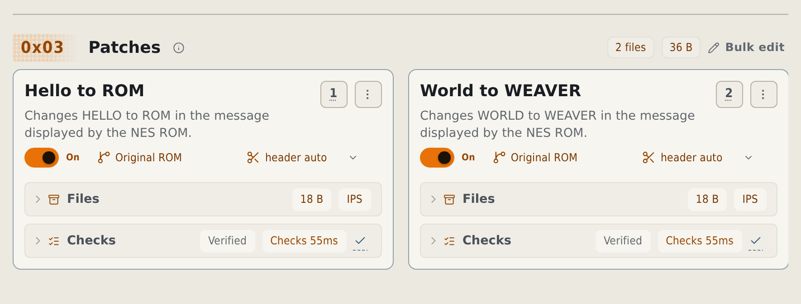
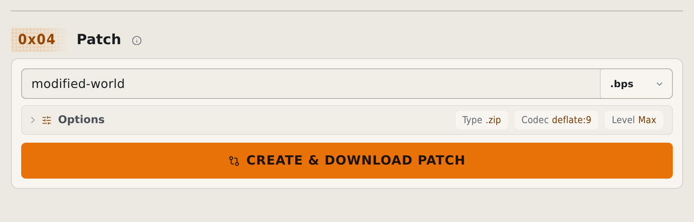
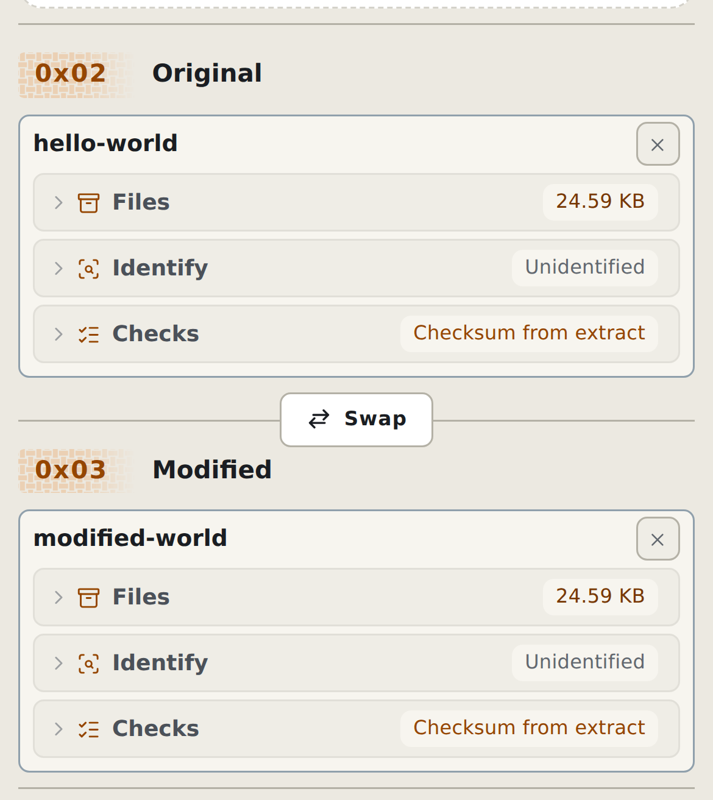
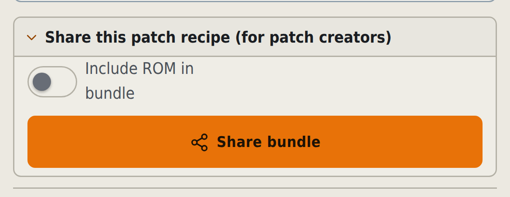

<h1 align="center"> rom-weaver</h1>

<p align="center">
  Local-first toolkit for ROMs and disc images: inspect, extract, compress, and apply, create, or bundle patches. Offline via a browser service-worker PWA or CLI.
</p>

<p align="center">
  <a href="https://www.npmjs.com/package/rom-weaver"></a>
  <a href="https://crates.io/crates/rom-weaver-cli"></a>
  <a href="https://github.com/orgs/rom-weaver/packages/container/package/rom-weaver-cli"></a>
  <a href="https://github.com/rom-weaver/homebrew-tap"></a>
</p>

<p align="center">
  <a href="https://github.com/rom-weaver/rom-weaver/actions/workflows/ci.yml"></a>
  <a href="package.json"></a>
  <a href=".config/mise.toml"></a>
  <a href="LICENSE"></a>
</p>

<p align="center">
  <a href="https://rom-weaver.com/apply">Open the webapp</a>
  · <a href="https://github.com/sponsors/brandonocasey">Sponsor on GitHub</a>
  · <a href="https://ko-fi.com/brandonocasey">Support on Ko-fi</a>
</p>

<!-- START doctoc -->

- [Install](#install)
- [Webapp](#webapp)
- [Self-hosting](#self-hosting)
- [CLI](#cli)
- [Why](#why)
- [Performance](#performance)
- [Features](#features)
- [Notices](#notices)
- [Screenshots](#screenshots)
- [Documentation](#documentation)
- [Contributing and support](#contributing-and-support)
- [License](#license)

<!-- END doctoc -->

## Install

Choose the [webapp](#webapp), [self-hosting](#self-hosting), or [CLI](#cli)
path below.

## Webapp

Open the hosted webapp at **[rom-weaver.com/apply](https://rom-weaver.com/apply)**. You
do not need to install anything or create an account. Choose **Apply**, add a
ROM and one or more patches, review the detected formats and checksums, then run
the workflow and save the result. Use **Create** to generate a distributable
patch from an original and a modified file. Your files are processed locally
and never leave the device. Install it as a PWA from the browser menu to use it
offline.
New here? [Try the sample workflow](https://rom-weaver.com/apply?bundle=first-weave.zip)
with a tiny original homebrew NES ROM and two patches that change “HELLO WORLD” to “MODIFIED ROM.”
For a guided explanation, use
[guided Apply](https://rom-weaver.com/apply?guide=apply),
[guided Create](https://rom-weaver.com/create?guide=create), or
[guided Bundle](https://rom-weaver.com/apply?guide=bundle).
To run the webapp on your own host, see the
[Self-hosting](#self-hosting) section below or the
[full self-hosting guide](./docs/hosting/self-hosting.md).

## Self-hosting

For a quick setup, choose static files, Docker Run, or Docker Compose. The
[full self-hosting guide](./docs/hosting/self-hosting.md) covers reverse proxies,
subpath routing, HTTPS certificates, service-worker scope, and the required
COOP/COEP headers.

Static release files:

```bash
mkdir -p rom-weaver-webapp
curl --fail --location --proto '=https' --tlsv1.2 \
  --output rom-weaver-webapp.tar.gz \
  https://github.com/rom-weaver/rom-weaver/releases/latest/download/rom-weaver-webapp.tar.gz
tar --extract --gzip --file rom-weaver-webapp.tar.gz --directory rom-weaver-webapp
```

Serve the extracted `rom-weaver-webapp` directory from an HTTPS static host.
For a pinned release, replace `latest` in the URL with its tag.

Docker Run using the published GitHub Container Registry (GHCR) image:

```bash
docker run --detach --name rom-weaver-webapp \
  --publish 8080:8080 \
  ghcr.io/rom-weaver/rom-weaver-webapp:latest
```

Docker Compose using the same published GitHub Container Registry (GHCR) image:
Download the [Docker Compose template](https://github.com/rom-weaver/rom-weaver/blob/main/docker-compose.yml)
into a new directory:

```bash
mkdir -p rom-weaver-compose
cd rom-weaver-compose
curl --fail --location --proto '=https' --tlsv1.2 \
  --output docker-compose.yml \
  https://raw.githubusercontent.com/rom-weaver/rom-weaver/main/docker-compose.yml
docker compose pull
docker compose up --detach
curl --fail --silent --show-error http://localhost:8080/health
```

Only Docker with Compose is required. Set `PORT` to change the host port, for
example `PORT=3000 docker compose up --detach`. To build the image from source
instead, clone the repository and add `--build` to the `docker compose up`
command from its checkout; that path is slower and intended for development.
For standalone TLS, mount a trusted certificate as described in the guide and
set `HTTPS_PORT` instead.

## CLI

Native release assets cover macOS arm64 and x86-64; Linux x86-64 GNU plus
x86-64, arm64, and i686 musl; and Windows arm64, x86-64, and x86. The package
manager and installer options below select the matching asset unless their
description says otherwise.

<details>
<summary>Homebrew (macOS arm64/Intel, Linux arm64/x86-64)</summary>

```bash
brew install rom-weaver/tap/rom-weaver
```

</details>

<details>
<summary>Scoop (Windows)</summary>

```powershell
scoop bucket add rom-weaver https://github.com/rom-weaver/scoop-bucket
scoop install rom-weaver
```

</details>

<details>
<summary>Install script (macOS, Linux)</summary>

Downloads the latest release to `~/.local/bin` and checks its GitHub build
attestation.
Override with `ROM_WEAVER_INSTALL_DIR` or pin with `ROM_WEAVER_VERSION`.
The script also installs manpages and shell completions for the current user.

```bash
curl --proto '=https' --tlsv1.2 -LsSf \
  https://raw.githubusercontent.com/rom-weaver/rom-weaver/main/install.sh | sh
```

</details>

<details>
<summary>Install script (Windows)</summary>

The same thing for PowerShell, installing to `%LOCALAPPDATA%\rom-weaver\bin`.
It also installs the PowerShell completion beside the executable.

```powershell
irm https://raw.githubusercontent.com/rom-weaver/rom-weaver/main/install.ps1 | iex
```

</details>

<details>
<summary>npm</summary>

Cross-platform, and the only channel that covers every supported target at
once. Needs Node.js 22+. The package is a launcher that pulls the right
prebuilt binary through platform-specific optional dependencies, so only your
platform's binary is downloaded.

```bash
npm install --global rom-weaver
```

For a one-off run, or to add the scoped launcher for a repository's scripts,
use the scoped package directly:

```bash
npx @rom-weaver/cli probe --input game.iso
npm install --save-dev @rom-weaver/cli
```

</details>

<details>
<summary>cargo-binstall</summary>

Downloads the same release binary rather than compiling the workspace:

```bash
cargo binstall rom-weaver-cli
```

</details>

<details>
<summary>mise</summary>

Useful when you want the CLI managed per project in `mise.toml`.
[Install mise](https://mise.jdx.dev/installing-mise.html) first; it verifies
the release's GitHub artifact attestations on install. The
`minimum_release_age=0s` option lets new releases resolve immediately on release
day; omit it if you prefer mise's default release-age delay.

```bash
mise use 'github:rom-weaver/rom-weaver[minimum_release_age=0s]'
```

</details>

<details>
<summary>Docker</summary>

Runs from the published Linux image without installing anything:

```bash
docker run --rm \
  --user "$(id -u):$(id -g)" \
  --volume "$PWD:/work" \
  ghcr.io/rom-weaver/rom-weaver-cli:latest \
  probe --input /work/game.iso
```

Mount your ROM directory at `/work` and pass paths under it. On Linux and
macOS, `--user` keeps files created in the bind mount owned by your host user.
See [Run in Docker](./docs/how-to/install-cli.md#run-in-docker).

</details>

<a name="build-from-source"></a>

<details>
<summary>Build from source</summary>

```bash
git clone https://github.com/rom-weaver/rom-weaver.git
cd rom-weaver
cargo install --path crates/rom-weaver-cli --locked
rom-weaver --help
```

The source build requires Rust 1.95+, CMake, Clang, and a native compiler
toolchain.

</details>

Hitting `Permission denied`? See
[File permissions](./docs/reference/cli.md#file-permissions).

The [development guide](./docs/development/development.md) covers the full toolchain setup,
webapp builds, and tests.

## Why

Every console generation brought its own compressed format: CHD for discs, RVZ
for GameCube and Wii, Z3DS for 3DS ROMs, CSO and PBP for PSP, plus the usual ZIP
and 7z on top. Working across them can mean finding several separate programs,
learning different flags, and checking which builds are available for your
platform.

Patching adds another manual sequence. A translation, bugfix, and undub may
need to run in a specific order, with intermediate files kept straight and a
compressed input unpacked before the first patch and recompressed afterward.
Repeating that setup whenever the patch combination changes adds disk churn and
room for mistakes to what should be one workflow.

The last piece is curation. Keeping a collection in order means storing ROMs
compressed, keeping the patches next to them, and being able to prove months
later that a patched file came from the ROM you think it did. rom-weaver
handles all of it in one place. It reads every format above. It writes CHD, RVZ,
Z3DS, ZIP, and 7z archives. It chains as many patches as you want in a single pass
without manually unpacking first, and records the whole recipe - patch order,
checksums, and output names - in a bundle file you can hand to someone else.
Native CLI builds are
available for Linux, macOS, and Windows. The browser webapp handles patching
and bundle workflows without an install.

For the current measurements and trade-offs, see the [performance brief](#performance).
For how rom-weaver lines up against the tools you may already use, the
[comparison with similar tools](./docs/explanation/comparisons.md) puts it
beside RomPatcher.js, Flips, MultiPatch, xdelta3, chdman, and Dolphin tool,
format by format and feature by feature.

## Performance

rom-weaver matches or beats the reference tools on every measured axis:
extraction time, compression time, and output size. On the measured arm64
corpus, extraction is faster in all four formats. CHD extracts 3.1–5.8× faster,
RVZ 1.6–2.0×, ZIP 1.6–2.7×, and 7z 1.0–4.7×. RVZ and ZIP compression are
1.1–1.3× faster. 7z compression is even with its reference. CHD compression
ranges from even to 1.3× faster. Output sizes match the references to within a
fraction of a percent.

The CLI and the threaded WASM webapp share one Rust engine. The browser adds
worker, storage, and OPFS costs, so CLI and browser timings are not
comparable. The [performance guide](./docs/development/performance.md) records
the machine, corpus, settings, reference-tool versions, and repeated runs for
each published result. It also lists the commands that reproduce them.
Production WASM is optimized with `wasm-opt -O4`. The browser codec matrix is
the runtime check for the shipped worker and storage path.

## Features

- **Apply and create patches.** Twenty-one formats, including IPS, BPS, UPS,
  xdelta/VCDIFF, PPF, RUP, BDF/BSDIFF40, APS, and DCP (Dreamcast), with ordered
  multi-patch chains, checksum validation when the format or bundle supplies
  expected values, and cheat-code baking. Three of them (DCP, BSP, and
  HDiffPatch) can only be applied, not created.
- **Inspect and extract containers.** ZIP, 7z, RAR, the tar family, CHD, RVZ,
  Z3DS, CSO, PBP, GCZ, WIA, WBFS, and more, including nested archives.
- **Create format-specific compressed containers.** ZIP, 7z, CHD, RVZ, and Z3DS with
  codec-aware compression settings. CHD and RVZ outputs are checked for
  round-trip compatibility with chdman and dolphin-tool.
- **Checksum and verify.** CRC32, MD5, SHA-1, SHA-256, BLAKE3, and friends,
  with copier-header detection, header repair, and header-aware checksum
  variants.
- **Trim and restore.** Trimming for NDS, GBA, 3DS, XISO, and RVZ scrub. NDS,
  GBA, and 3DS can be reverted, with an opt-in footer that restores the
  original file byte-for-byte.
- **Share workflows.** Distributable [`rom-weaver-bundle.json`](./docs/rom-weaver-bundle-v1.schema.json)
  bundles pin patch order, checksums, and output naming so others can replay
  the exact workflow.
- **Local-first and private.** Everything runs on your machine. The webapp is
  an installable PWA that works offline and never uploads your files.
- **One engine, two frontends.** The same Rust core powers the terminal CLI
  and the threaded WASM webapp. CLI operation commands can emit line-delimited
  JSON for scripting.

The complete format, codec, and checksum compatibility tables are maintained
in the [CLI guide](./docs/reference/formats.md).

## Notices

### Beta status

rom-weaver is beta software and follows Semantic Versioning, but until v1.0,
breaking changes may still happen between minor releases. Patching,
compressing, extracting, and bundling are covered by automated tests. Hands-on
testing happens on macOS and Linux; Windows is covered by hosted CI but has seen
much less real-world use, so expect rougher edges there and please report
anything Windows-specific. If you
rely on the APIs or CLI flags, expect things to be a bit tougher: those
interfaces may still change as the project heads toward v1.0. Trim and Tools are
still beta, so they are disabled by default in the webapp and can be enabled in
Settings. The `rom-weaver-core`, `-checksum`, `-containers`, and
`-patches` crates are published to crates.io only so `rom-weaver-cli` can use
them. The CLI and the webapp are the supported interfaces; using those crates as
libraries in another project is not supported.

### First complete public release

v0.7.2 was the first complete public release. The changelog and the git
history go back further, but v0.6.0 through v0.7.1 failed partway through the
release pipeline or were only partially published. v0.7.1 completed most of
the pipeline, but it still missed the crates.io CLI package, shipped a broken
unscoped npm launcher, and built the static webapp archive with mismatched
release metadata. Starting with v0.7.2, all public install methods were intended
to work together. Install commands below resolve the current release unless you
explicitly pin a version.

### LLM-assisted development

rom-weaver is built by a full-time software engineer in my spare time. Claude
and ChatGPT are used during development for brainstorming, implementation,
debugging, and review. I make the engineering decisions and review and test
the resulting work myself; the goal is high-quality, dependable software, but
AI-assisted code may still need extra scrutiny.

### Translations

Localized translations are early and may be entirely wrong in places. Manual
edits and corrections are welcome.

## Screenshots

[View every screenshot at full size.](./docs/development/screenshots.md)

<table>
  <thead>
    <tr>
      <th scope="col">Name</th>
      <th scope="col">Screenshot</th>
    </tr>
  </thead>
  <tbody>
    <tr>
      <td>Desktop: ordered patch stack</td>
      <td>
        <picture>
          <source media="(prefers-color-scheme: dark)" srcset="docs/screenshots/apply-patches-desktop-dark.webp">
          
        </picture>
      </td>
    </tr>
    <tr>
      <td>Desktop: create output</td>
      <td>
        <picture>
          <source media="(prefers-color-scheme: dark)" srcset="docs/screenshots/create-output-desktop-dark.webp">
          
        </picture>
      </td>
    </tr>
    <tr>
      <td>Mobile: Original and Modified</td>
      <td align="center">
        <picture>
          <source media="(prefers-color-scheme: dark)" srcset="docs/screenshots/create-inputs-mobile-dark.webp">
          
        </picture>
      </td>
    </tr>
    <tr>
      <td>Mobile: bundle output options</td>
      <td align="center">
        <picture>
          <source media="(prefers-color-scheme: dark)" srcset="docs/screenshots/bundle-output-mobile-dark.webp">
          
        </picture>
      </td>
    </tr>
  </tbody>
</table>

## Documentation

Start with the browser-first [documentation home](https://rom-weaver.com/docs)
or the repository [documentation index](./docs/README.md). The web docs include
a task and tool picker, guided samples, focused screenshots, and a
[FAQ](./docs/faq.md). CLI, deployment, integration, development,
architecture, and format references each have their own guides.

## Contributing and support

Bug reports and contributions are welcome. Read the
[contribution guide](CONTRIBUTING.md) and [code of conduct](.github/CODE_OF_CONDUCT.md)
before submitting a change. Because rom-weaver is dual-licensed, code and
documentation changes need a one-time signature on the
[Contributor License Agreement](CLA.md). The `CLA Signed` check asks for
it on your first pull request. One signature covers every repository in the
[`rom-weaver` organization](https://github.com/rom-weaver) whose contribution
process references the agreement. You keep the copyright in your work. Report
suspected vulnerabilities through GitHub's private reporting form in the
[security policy](.github/SECURITY.md). If rom-weaver has been useful to you, you can
support continued development through
[GitHub Sponsors](https://github.com/sponsors/brandonocasey) or
[Ko-fi](https://ko-fi.com/brandonocasey).

## License

Copyright © Brandon Casey and rom-weaver contributors

The public distribution is licensed under
[AGPL-3.0-or-later](LICENSE). [Commercial licensing](COMMERCIAL.md) is
also available for first-party rom-weaver code. Bundled third-party components
retain their own licenses. Release builds include a generated
[combined attribution and license inventory](https://rom-weaver.com/NOTICE) and
corresponding license texts. Those third-party terms continue to apply under
every rom-weaver licensing option.
