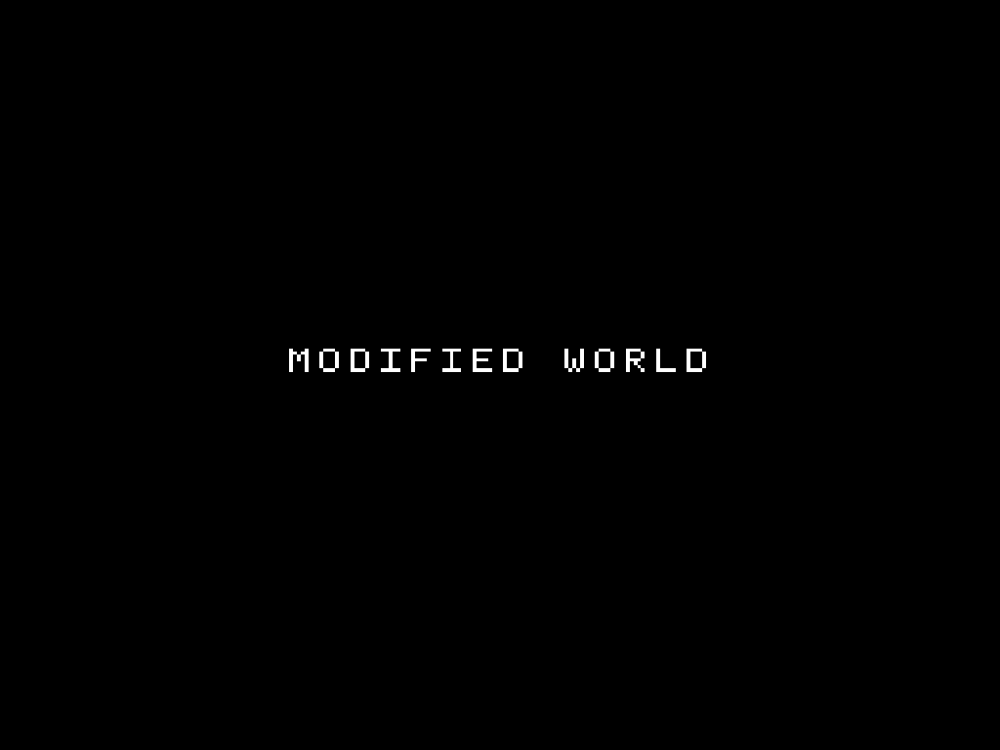

# Screenshots

<!-- START doctoc -->
## Table of contents

- [Desktop](#desktop)
  - [Apply patches (Weave)](#apply-patches-weave)
  - [Create a patch](#create-a-patch)
- [Mobile](#mobile)
  - [Apply patches (Weave)](#apply-patches-weave-1)
  - [Create a patch](#create-a-patch-1)
- [Sample ROMs](#sample-roms)

<!-- END doctoc -->

## Desktop

### Apply patches (Weave)

<picture>
  <source media="(prefers-color-scheme: dark)" srcset="../packages/rom-weaver-webapp/design/weave-desktop-dark.webp">
  
</picture>

### Create a patch

<picture>
  <source media="(prefers-color-scheme: dark)" srcset="../packages/rom-weaver-webapp/design/create-desktop-dark.webp">
  
</picture>

## Mobile

### Apply patches (Weave)

  <picture>
    <source media="(prefers-color-scheme: dark)" srcset="../packages/rom-weaver-webapp/design/weave-mobile-dark.webp">
    
  </picture>

### Create a patch

  <picture>
    <source media="(prefers-color-scheme: dark)" srcset="../packages/rom-weaver-webapp/design/create-mobile-dark.webp">
    
  </picture>

## Sample ROMs

| Original ROM | After the first patch | After both patches |
| :---: | :---: | :---: |
|  |  |  |
