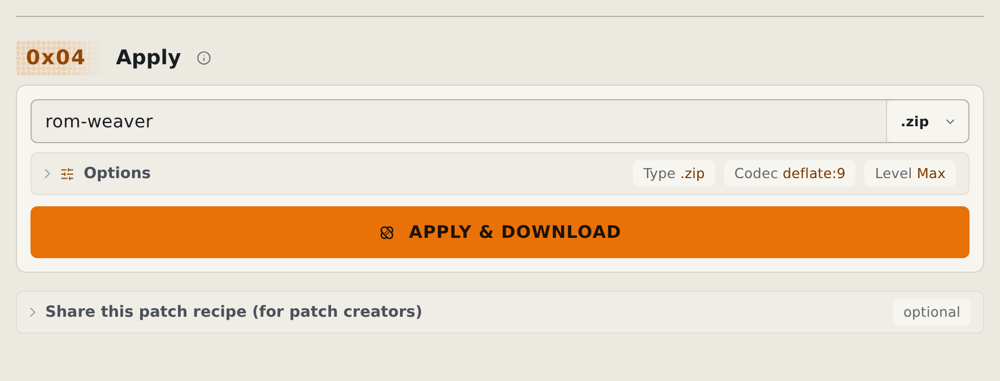
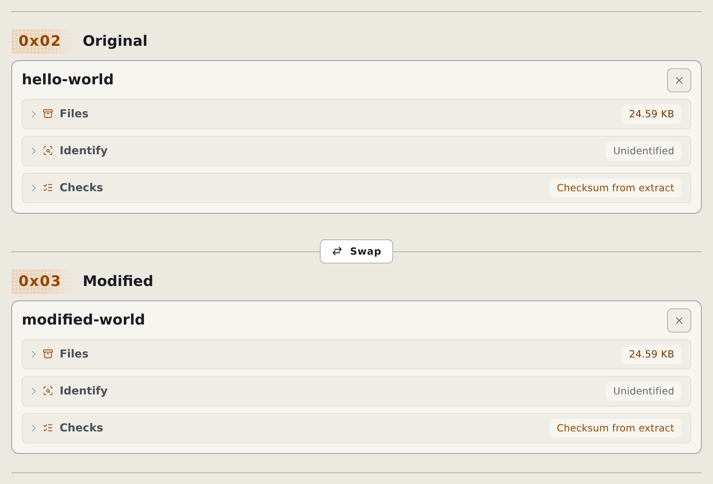
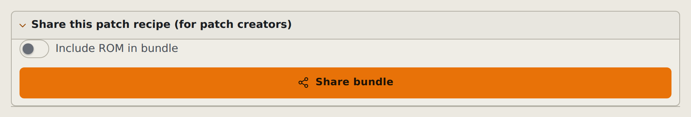
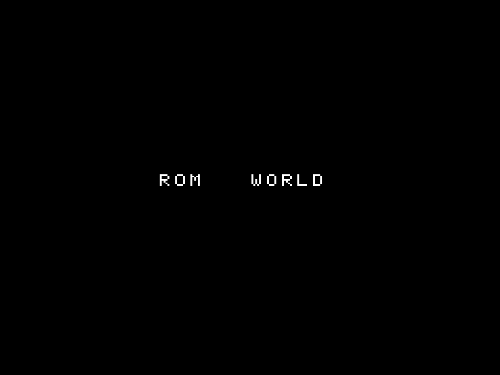
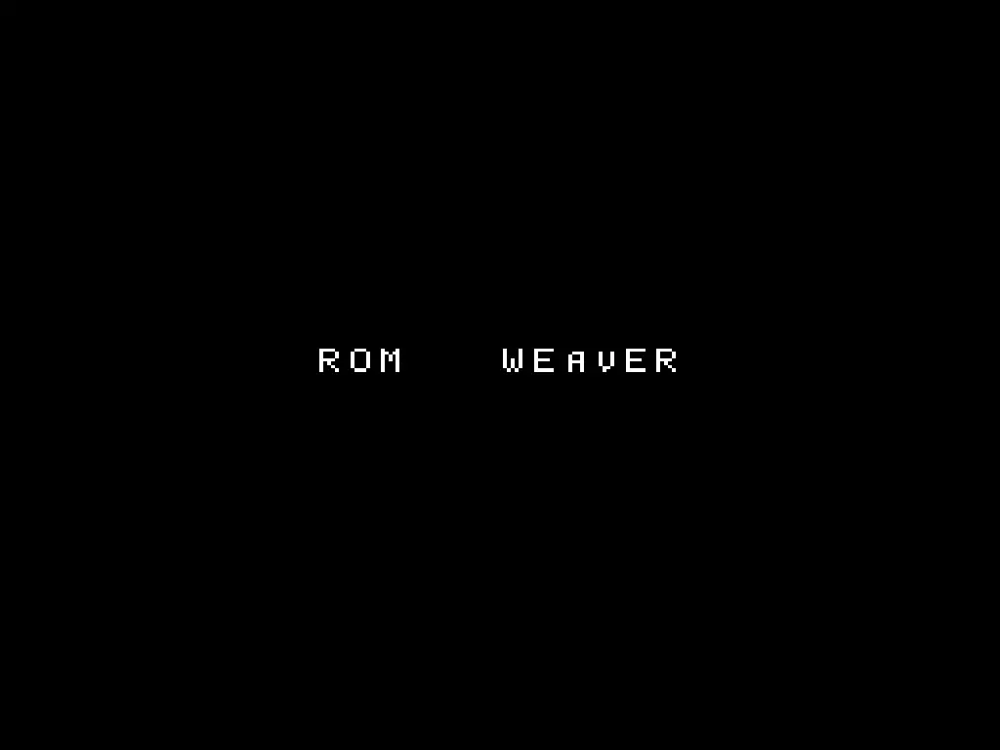

# Screenshots and sample assets

The documentation uses focused captures of real sample workflows. The committed images live in `docs/screenshots/`, with desktop and mobile versions in both light and dark themes.

<!-- START doctoc -->
## Table of contents

- [Apply patches](#apply-patches)
  - [Ordered patch stack](#ordered-patch-stack)
  - [Apply output](#apply-output)
- [Create a patch](#create-a-patch)
  - [Original and Modified](#original-and-modified)
  - [Patch output](#patch-output)
- [Create a bundle](#create-a-bundle)
- [Sample ROMs](#sample-roms)
- [Regenerate the captures](#regenerate-the-captures)

<!-- END doctoc -->

## Apply patches

### Ordered patch stack

<picture>
  <source media="(prefers-color-scheme: dark)" type="image/avif" srcset="../screenshots/apply-patches-desktop-dark.avif">
  <source type="image/avif" srcset="../screenshots/apply-patches-desktop-light.avif">
  <source media="(prefers-color-scheme: dark)" type="image/webp" srcset="../screenshots/apply-patches-desktop-dark.webp">
  
</picture>

### Apply output

<picture>
  <source media="(prefers-color-scheme: dark)" type="image/avif" srcset="../screenshots/apply-output-desktop-dark.avif">
  <source type="image/avif" srcset="../screenshots/apply-output-desktop-light.avif">
  <source media="(prefers-color-scheme: dark)" type="image/webp" srcset="../screenshots/apply-output-desktop-dark.webp">
  
</picture>

Mobile versions: [patch stack](../screenshots/apply-patches-mobile-light.webp) and [Apply output](../screenshots/apply-output-mobile-light.webp). The web guide selects these automatically on narrow screens and switches to their dark variants with the site theme.

## Create a patch

### Original and Modified

<picture>
  <source media="(prefers-color-scheme: dark)" type="image/avif" srcset="../screenshots/create-inputs-desktop-dark.avif">
  <source type="image/avif" srcset="../screenshots/create-inputs-desktop-light.avif">
  <source media="(prefers-color-scheme: dark)" type="image/webp" srcset="../screenshots/create-inputs-desktop-dark.webp">
  
</picture>

### Patch output

<picture>
  <source media="(prefers-color-scheme: dark)" type="image/avif" srcset="../screenshots/create-output-desktop-dark.avif">
  <source type="image/avif" srcset="../screenshots/create-output-desktop-light.avif">
  <source media="(prefers-color-scheme: dark)" type="image/webp" srcset="../screenshots/create-output-desktop-dark.webp">
  
</picture>

Mobile versions: [Original and Modified](../screenshots/create-inputs-mobile-light.webp) and [patch output](../screenshots/create-output-mobile-light.webp).

## Create a bundle

<picture>
  <source media="(prefers-color-scheme: dark)" type="image/avif" srcset="../screenshots/bundle-output-desktop-dark.avif">
  <source type="image/avif" srcset="../screenshots/bundle-output-desktop-light.avif">
  <source media="(prefers-color-scheme: dark)" type="image/webp" srcset="../screenshots/bundle-output-desktop-dark.webp">
  
</picture>

The [mobile capture](../screenshots/bundle-output-mobile-light.webp) keeps the entire expanded Output Options card readable.

## Sample ROMs

| Original ROM | After the first patch | After both patches |
| :---: | :---: | :---: |
|  |  |  |

The webapp generates `first-weave.zip`, `first-create.zip`, and the loose homebrew ROMs from [`first-sample-assets.mjs`](../../packages/rom-weaver-webapp/scripts/first-sample-assets.mjs). The guided tours and automated tests use the same assets.

## Regenerate the captures

Build and serve the production webapp, then run:

```bash
ROM_WEAVER_SCREENSHOT_BASE_URL=http://127.0.0.1:4173/ \
  npm --prefix packages/rom-weaver-webapp run capture:screenshots
```

The capture script opens the generated samples, waits for reading and checksum work to settle, and crops to the controls each guide explains. It renders desktop at 2x and mobile at 3x, then saves AVIF images with lossless WebP fallbacks.

To regenerate one subject while adjusting its crop:

```bash
ROM_WEAVER_SCREENSHOT_BASE_URL=http://127.0.0.1:4173/ \
ROM_WEAVER_SCREENSHOT_CASE=bundle-output \
  npm --prefix packages/rom-weaver-webapp run capture:screenshots
```

The build verifies that every documented device and theme variant exists and is referenced by its guide.
