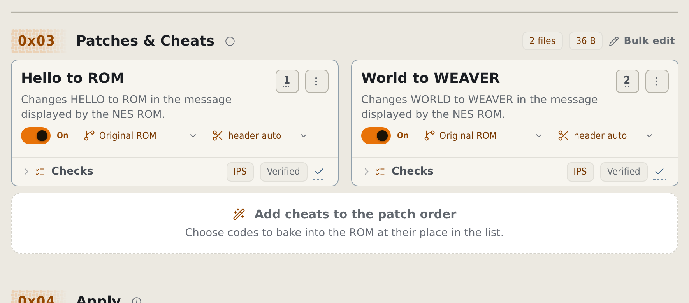
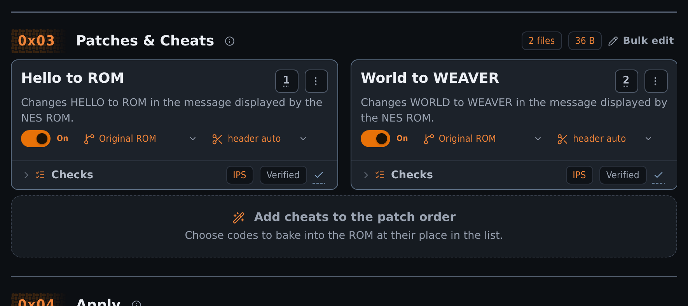
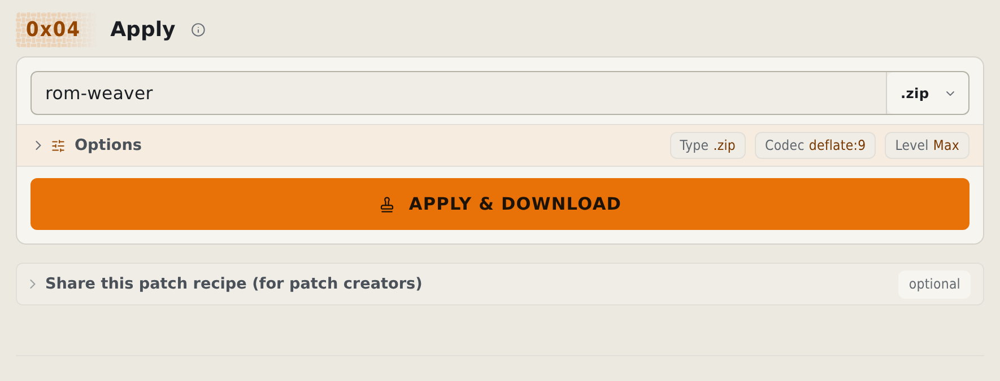
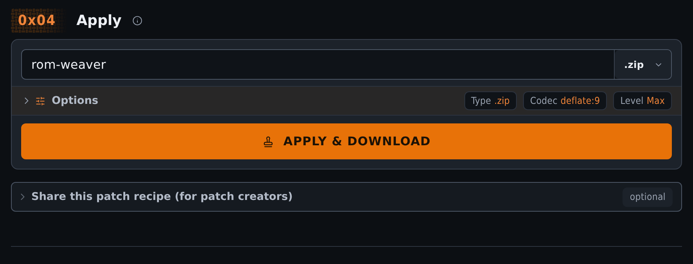

# Apply BPS, IPS, UPS, and xdelta ROM patches online

Apply BPS, IPS, UPS, xdelta, PPF, and other supported ROM patches locally in your browser. Your original stays untouched. No uploads or account are needed.

<!-- START doctoc -->
## Table of contents

- [What do you need?](#what-do-you-need)
- [Add the files](#add-the-files)
- [Apply a BPS patch](#apply-a-bps-patch)
- [Apply an IPS or IPS32 patch](#apply-an-ips-or-ips32-patch)
- [Apply a UPS patch](#apply-a-ups-patch)
- [Apply an xdelta or VCDIFF patch](#apply-an-xdelta-or-vcdiff-patch)
- [Apply a PPF patch](#apply-a-ppf-patch)
- [Apply APS, APSGBA, RUP, and other patch formats](#apply-aps-apsgba-rup-and-other-patch-formats)
- [Apply an HDiffPatch or HPatchZ patch](#apply-an-hdiffpatch-or-hpatchz-patch)
- [Dreamcast DCP patches need the CLI](#dreamcast-dcp-patches-need-the-cli)
- [Read the ROM and patch cards](#read-the-rom-and-patch-cards)
- [Put several patches in order](#put-several-patches-in-order)
- [Add cheats to the patch order](#add-cheats-to-the-patch-order)
- [Choose the output and apply](#choose-the-output-and-apply)
- [Open a bundle](#open-a-bundle)
- [If the ROM does not match](#if-the-rom-does-not-match)
- [Use the result safely](#use-the-result-safely)

<!-- END doctoc -->

Never done this before? [Your first patch in the browser](../tutorials/first-patch.md) walks the same workflow with homebrew practice files first, using [guided Apply](https://rom-weaver.com/apply-patches?guide=apply).

For a compressed-disc practice run, [patch a supplied CHD](../tutorials/patch-compressed-disc.md) with two ordered patches and verify the result.

## What do you need?

You need the patch and your own copy of the exact game release it was made for. The files have different roles:

- **Original ROM:** the starting game file named by the patch author. Add it to Apply alongside the patch. Keep a clean copy.
- **Patch:** a file such as `.bps`, `.ips`, or `.xdelta` that describes changes to the original ROM.
- **Archive:** a ZIP, 7z, or RAR that can contain a ROM, a patch, or both. Its extension identifies the archive, not the patch format.
- **Output ROM:** the new game file created by applying the patch. This is the result you download and use in a compatible emulator or on supported hardware.

Keep the patch author's notes open. Look for:

- region, such as USA, Japan, or Europe;
- revision, such as Rev 0 or Rev 1;
- a checksum and its algorithm;
- whether the ROM has a header;
- the required order when there is more than one patch.

Compare the checksum, not just the filename. [How patching works](../explanation/how-patching-works.md#what-a-checksum-proves-and-what-a-filename-does-not) explains the difference.

If you know the ROM but do not have the file, type its checksum or its game name into **Identify by checksum or game name**. It sits under the drop zone on the empty page, and in **0x02 ROM** once a patch is loaded. A checksum shows the expected ROM directly. A name lists the matching games on every system; choose one, then choose its region or revision. Either way the card shows the expected ROM: its title, its region and revision, and every checksum and the size the local identification data holds. Nothing is uploaded.

The search appears only while nothing else names the ROM. A bundle entry, or a patch that records its own source, already answers the question.

Keep one clean original somewhere safe. rom-weaver writes a separate result, but a known-good copy makes updates and troubleshooting much easier.

## Add the files

1. Open [Apply](https://rom-weaver.com/apply-patches).
2. Drag the ROM and patch onto **0x01 Inputs**, or choose **Add files**. You may add both at once, or drop the folder that holds them.
3. Wait while the temporary cards say **Reading** or **Checksumming**.
4. If an archive contains several possible files, choose the entry the patch author named.

You can add [supported archives](../reference/formats.md#container-and-compression-formats), including ZIP, 7z, RAR, and tar, without extracting them first. rom-weaver looks inside, including inside nested archives. Disc containers such as CHD and RVZ are unpacked to the form the patch expects.

The page changes after the files are understood. **ROM** holds the game, **Patches & Cheats** holds the ordered steps, and **Apply** controls the new file.

Use [cheats](use-browser-cheats.md) to add supported codes to that order. To change only the container, follow [Convert a ROM](convert-roms-browser.md).

For a practice run, open [guided Apply](https://rom-weaver.com/apply-patches?guide=apply). It starts on this drop zone and waits for you to add files; choose **Continue** on its card to use the practice files if you have none. The [guided Apply cheats tour](https://rom-weaver.com/apply-patches?guide=apply-cheats) loads a supplied homebrew ROM and a working sample code. [Ways files get into Apply](../reference/guided-runs.md#ways-files-get-into-apply) lists every route in one table.

## Apply a BPS patch

To apply a BPS patch to a ROM:

1. Open [Apply](https://rom-weaver.com/apply-patches).
2. Add the `.bps` patch and the clean ROM named by its author to **0x01 Inputs**. You can add them together, including inside a supported archive.
3. Wait for the files to be read. Check the ROM's region and revision against the author's notes, then open **Checks** to inspect the patch's source check. BPS records the expected source checksum; if it fails, follow [Fix a source ROM checksum mismatch](fix-checksum-errors.md).
4. Set the output name. Choose a plain output file unless your emulator or the patch author requires a compressed format.
5. Choose **APPLY & DOWNLOAD** after the checks match. Use the downloaded output ROM and keep your clean original for future patches.

For several patches, follow [Put several patches in order](#put-several-patches-in-order). The [CLI Apply guide](cli-apply.md) has the terminal command for the same BPS workflow.

## Apply an IPS or IPS32 patch

Add the `.ips` or `.ips32` patch with the ROM named by its author. Check the author's source checksum through [Checksum](checksum-roms-browser.md) before applying it.

IPS and IPS32 contain no source checksum. A successful patch operation alone does not prove that you used the correct ROM. Check the required header state, then use **APPLY & DOWNLOAD**.

## Apply a UPS patch

Add the `.ups` patch and the clean ROM together. Read the patch card's input checks before selecting **APPLY & DOWNLOAD**.

If the check fails, compare the required region, revision, and header state with the author's notes. Follow [Fix a checksum error](fix-checksum-errors.md) before applying the patch.

## Apply an xdelta or VCDIFF patch

Add the patch as supplied, including an `.xdelta`, `.delta`, `.dat`, or `.vcdiff` file. For disc patches, use the exact image or track named by the author.

Compare any published source checksum before applying. Source checks depend on how the patch was made. Select a plain output file unless the author or emulator requires compression, then use **APPLY & DOWNLOAD**.

## Apply a PPF patch

Add the `.ppf` file and the exact ROM or disc track the author named. Check the image layout as well as its checksum. For a BIN/CUE disc, add the cue sheet and all referenced tracks.

Use **APPLY & DOWNLOAD** after the input checks pass. To restore a result from a PPF3 patch with undo data, follow [Undo PPF](undo-ppf-browser.md).

## Apply APS, APSGBA, RUP, and other patch formats

Use the same [input steps](#add-the-files) for APS, APSGBA, RUP, SOLID, GDIFF, PAT/FireFlower, EBP, BDF/BSDIFF40, BSP, MOD/PMSR, DLDI, and DPS. Check the detected format on the patch card.

Use the author's source file and checksum. Wait for the input checks, choose the output, then select **APPLY & DOWNLOAD**. The [format reference](../reference/formats.md#patch-formats) lists extensions and creation support.

## Apply an HDiffPatch or HPatchZ patch

Add a single-file `.hdiff` or `.hpatchz` patch and the source file it expects. Compare the author's source checksum, then use **APPLY & DOWNLOAD**.

Directory patches marked `HDIFF19` are unsupported. Use the author's directory-patching tool for those inputs.

## Dreamcast DCP patches need the CLI

Use the [CLI Dreamcast DCP procedure](cli-apply.md#apply-a-dreamcast-dcp-patch) for `.dcp` files. Browser Apply does not support the required disc-sheet workflow.

NINJA1 and PDS patches cannot be applied. Check the [support limits](../reference/formats.md#patch-formats) before choosing a patcher.

## Read the ROM and patch cards

Start with the labels and warning colors, then open **Checks** if you need the numbers.

The ROM card shows the selected filename, size, detected system, and checksums. A message about the expected filename is advice. The name can differ while the bytes are still correct. A checksum or expected-size failure is strict and means the bytes do not match.

Each patch card shows its format and position. Open **Checks** to see the state that the patch's input checks describe and the result that its output checks describe. Open the three-dot **Patch actions** menu to edit details, replace the file, or remove it. Header controls appear only for formats and systems where they make sense.

<figure class="docs-screenshot">
  <picture data-docs-screenshot-theme="light">
    <source media="(max-width: 520px)" type="image/avif" srcset="../screenshots/apply-patches-mobile-light.avif" width="1170" height="1433">
    <source type="image/avif" srcset="../screenshots/apply-patches-desktop-light.avif" width="1770" height="788">
    <source media="(max-width: 520px)" type="image/webp" srcset="../screenshots/apply-patches-mobile-light.webp" width="1170" height="1433">
    
  </picture>
  <picture data-docs-screenshot-theme="dark">
    <source media="(max-width: 520px)" type="image/avif" srcset="../screenshots/apply-patches-mobile-dark.avif" width="1170" height="1433">
    <source type="image/avif" srcset="../screenshots/apply-patches-desktop-dark.avif" width="1770" height="788">
    <source media="(max-width: 520px)" type="image/webp" srcset="../screenshots/apply-patches-mobile-dark.webp" width="1170" height="1433">
    
  </picture>
  <figcaption>Patches run from top to bottom. Each card shows the checks for that step.</figcaption>
</figure>

## Put several patches in order

Patches run from top to bottom and modify one result. Each patch card has an input selector. This selector chooses the state that the patch runs on. The patch's **Input** checks must match that state.

Keep **auto** to let the checks select the state. Choose **Original ROM** when the patch was made from the clean ROM. Choose **Previous patch output** when the patch depends on the result above it.

Drag a numbered handle to move a patch. With a keyboard, focus the handle and use its announced controls. The number changes when the card moves.

The On or Off switch temporarily skips a patch. This is useful for optional add-ons, but only use combinations the author says are compatible. Turning off a required base patch can make everything below it fail.

After changing an input, the order, or a switch, read each patch's **Checks** summary again. **Input checks** describe the state the patch was authored for. An embedded **Output** check describes that patch's standalone result. It does not verify a combined result when earlier patches changed the same source.

For example, suppose a project supplies `translation.bps` and `translation-fix.bps`. Its notes say the fix requires the translated ROM.

1. Add the clean ROM and both patches to **0x01 Inputs**.
2. Put `translation.bps` first and set its input to **Original ROM**.
3. Put `translation-fix.bps` second and set its input to **Previous patch output**.
4. Open **Checks** on both cards and resolve any input mismatches.
5. Choose the output format, select **APPLY & DOWNLOAD**, and save the result.

This example is hypothetical. Use the order and input states from your patch author's notes.

## Add cheats to the patch order

1. Add the original ROM and any patches it needs.
2. In **Patches & Cheats**, select **Add cheats to the patch order**.
3. Add compatible entries from the database, or select **Add code manually**.
4. Put each cheat where it must run in the ordered patch stack.
5. Resolve any unsupported-code or write-conflict message before you apply.

A cheat changes the bytes produced by the steps above it. Check the game and revision when the database match is based on a title instead of exact checksums. [Use cheats in the browser](use-browser-cheats.md) covers manual-code checks, patch export, and offline use.

## Choose the output and apply

If **APPLY & DOWNLOAD** is disabled, wait for reading and checksumming to finish. Read the nearby notice and resolve any failed checks.

In **Apply**:

1. Enter an output filename without an extension.
2. Pick a plain file or a compressed output format. The format selector adds the extension.
3. Open **Options** only if you need compression, output header, or bundle controls. The defaults are right for most patches.
4. Choose **APPLY & DOWNLOAD**.
5. Wait for the button to finish, then save the browser download.

<figure class="docs-screenshot">
  <picture data-docs-screenshot-theme="light">
    <source media="(max-width: 520px)" type="image/avif" srcset="../screenshots/apply-output-mobile-light.avif" width="1170" height="795">
    <source type="image/avif" srcset="../screenshots/apply-output-desktop-light.avif" width="1770" height="676">
    <source media="(max-width: 520px)" type="image/webp" srcset="../screenshots/apply-output-mobile-light.webp" width="1170" height="795">
    
  </picture>
  <picture data-docs-screenshot-theme="dark">
    <source media="(max-width: 520px)" type="image/avif" srcset="../screenshots/apply-output-mobile-dark.avif" width="1170" height="795">
    <source type="image/avif" srcset="../screenshots/apply-output-desktop-dark.avif" width="1770" height="676">
    <source media="(max-width: 520px)" type="image/webp" srcset="../screenshots/apply-output-mobile-dark.webp" width="1170" height="795">
    
  </picture>
  <figcaption>Choose the output name and format before applying.</figcaption>
</figure>

Everything happens locally in the browser. The ROM, patches, and result are not sent to rom-weaver - see [why your files stay on your device](../explanation/local-first.md).

## Open a bundle

A [bundle](../explanation/bundles.md) is a saved patching recipe. Add the bundle archive to **0x01 Inputs**. If it is patch-only, rom-weaver shows which ROM it expects. Add your matching ROM. Review optional patch switches, then use **APPLY & DOWNLOAD** just as you would for loose files.

A release author can also give you a link that opens the bundle directly in Apply. The same local checks still happen before anything is written.

Want to publish one? [Create and share a patch bundle](create-bundles.md) has a separate browser-only guide and its own guided sample.

## If the ROM does not match

Follow [Fix a checksum error](fix-checksum-errors.md) before applying. That guide checks region, revision, archive selection, headers, Nintendo 64 byte order, patch order, and earlier modifications. A different filename alone is advisory; a checksum or size mismatch blocks the run.

## Use the result safely

Open the downloaded result in the emulator or hardware you trust. Reaching the title screen is a useful first check, but play far enough to exercise the change when you can. Some bad combinations fail later.

Do not delete the clean original. Give the patched result a name that includes the project and version so you can tell it apart later.

If you need automation or terminal commands, switch to the [CLI apply guide](cli-apply.md). If you want to make your own change, continue with [Create a ROM patch](create-rom-patches.md).
