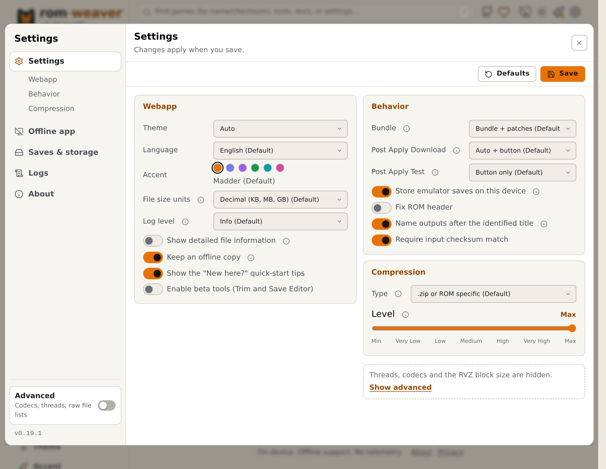
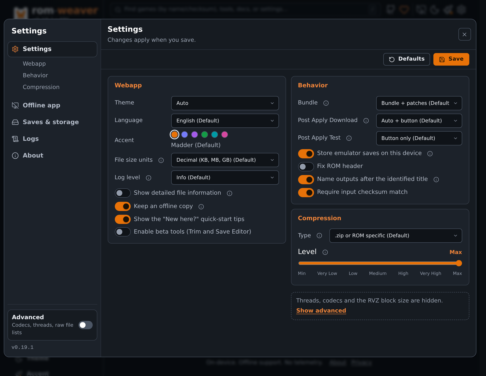
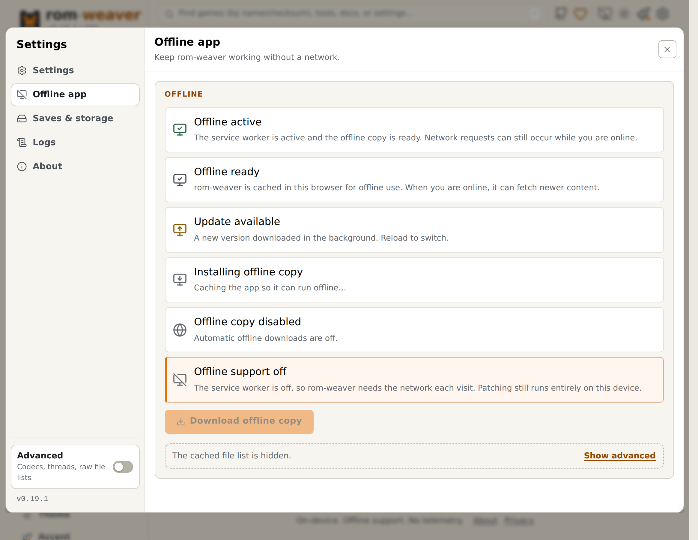
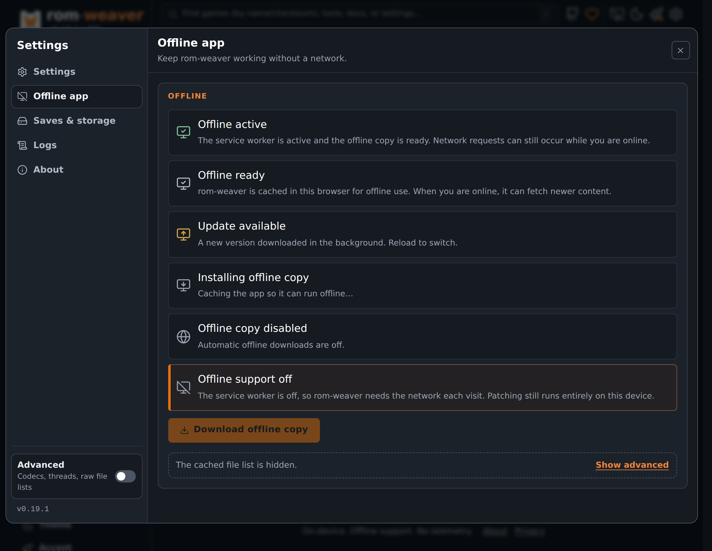

# Set up the browser app

Use Settings to change app preferences, enable beta tools, and prepare local assets for offline use.

<!-- START doctoc -->
## Table of contents

- [Change preferences](#change-preferences)
- [Enable beta tools](#enable-beta-tools)
- [Prepare for offline use](#prepare-for-offline-use)
- [Back up saves and manage storage](#back-up-saves-and-manage-storage)

<!-- END doctoc -->

## Change preferences

Open **Settings** from the app navigation. On a phone, select **Menu** at the right end of the bottom bar, then **Settings**. Change the required values, then select **Save**.

The settings cover language, byte units, guided help, output defaults, and compression. Guided help is the sample link under each empty drop zone, such as **Patch a sample**, that starts the [guided practice runs](../reference/guided-runs.md). Turn on **Advanced** to show worker threads, codecs, and the RVZ block size. Leave automatic thread selection enabled unless you need to limit resource use.

<figure class="docs-screenshot">
  <picture data-docs-screenshot-theme="light">
    <source media="(max-width: 520px)" type="image/avif" srcset="../screenshots/settings-mobile-light.avif" width="1170" height="2532">
    <source type="image/avif" srcset="../screenshots/settings-desktop-light.avif" width="2328" height="1800">
    <source media="(max-width: 520px)" type="image/webp" srcset="../screenshots/settings-mobile-light.webp" width="1170" height="2532">
    
  </picture>
  <picture data-docs-screenshot-theme="dark">
    <source media="(max-width: 520px)" type="image/avif" srcset="../screenshots/settings-mobile-dark.avif" width="1170" height="2532">
    <source type="image/avif" srcset="../screenshots/settings-desktop-dark.avif" width="2328" height="1800">
    <source media="(max-width: 520px)" type="image/webp" srcset="../screenshots/settings-mobile-dark.webp" width="1170" height="2532">
    
  </picture>
  <figcaption>Settings changes apply when you select Save.</figcaption>
</figure>

To leave Settings on a phone, select **Close** at the right end of the bottom bar, swipe right from the left edge of the screen, or use your browser's back gesture.

The separate **Theme** and **Accent** controls in the navigation apply changes immediately. Theme offers light, dark, and system appearance; Accent changes the highlight color.

## Enable beta tools

1. Open **Settings**.
2. Select **Enable beta tools (Trim and Save Editor)**.
3. Select **Save**.
4. Open the required tool from the app's navigation.

This exposes Trim and Save Editor. PPF Undo and cheat tools in Apply, Create, and Identify do not require this setting.

## Prepare for offline use

1. While online, open **Settings**, select **Keep an offline copy**, then **Save**.
2. Wait for the app's offline download to finish.
3. Reopen **Settings** and select the **Optional ROM databases** you need. These choices download immediately.
4. Open the sample, bundle, or cheat list you plan to use while online.
5. Load a game for each emulator system you need, so its core is cached.

Check the result before relying on it: disconnect your device, reopen rom-weaver, and run a small local job.

<figure class="docs-screenshot">
  <picture data-docs-screenshot-theme="light">
    <source media="(max-width: 520px)" type="image/avif" srcset="../screenshots/offline-mobile-light.avif" width="1170" height="2532">
    <source type="image/avif" srcset="../screenshots/offline-desktop-light.avif" width="2328" height="1800">
    <source media="(max-width: 520px)" type="image/webp" srcset="../screenshots/offline-mobile-light.webp" width="1170" height="2532">
    
  </picture>
  <picture data-docs-screenshot-theme="dark">
    <source media="(max-width: 520px)" type="image/avif" srcset="../screenshots/offline-mobile-dark.avif" width="1170" height="2532">
    <source type="image/avif" srcset="../screenshots/offline-desktop-dark.avif" width="2328" height="1800">
    <source media="(max-width: 520px)" type="image/webp" srcset="../screenshots/offline-mobile-dark.webp" width="1170" height="2532">
    
  </picture>
  <figcaption>Offline app shows whether this browser holds an offline copy.</figcaption>
</figure>

Remote bundle links still need network access unless their required files are available locally. Browser storage eviction can remove cached assets.

[Offline behavior](../explanation/local-first.md#offline) explains these limits. [Test a ROM](test-roms-in-browser.md) covers emulator controls.

## Back up saves and manage storage

Before clearing site data, [export emulator saves](test-roms-in-browser.md#export-and-restore-a-save).

Use **Saves & storage** to inspect emulator saves. Turn on **Advanced** to list the working files too. Clear an **Optional ROM databases** selection in Settings to remove that group's cached data.

Remove only data you no longer need. Browser site-data controls can remove the entire local app cache.

[Privacy](../legal/privacy.md) lists what the browser stores. [Webapp status](../hosting/webapp-runtime-status.md) explains the version and offline status labels.
