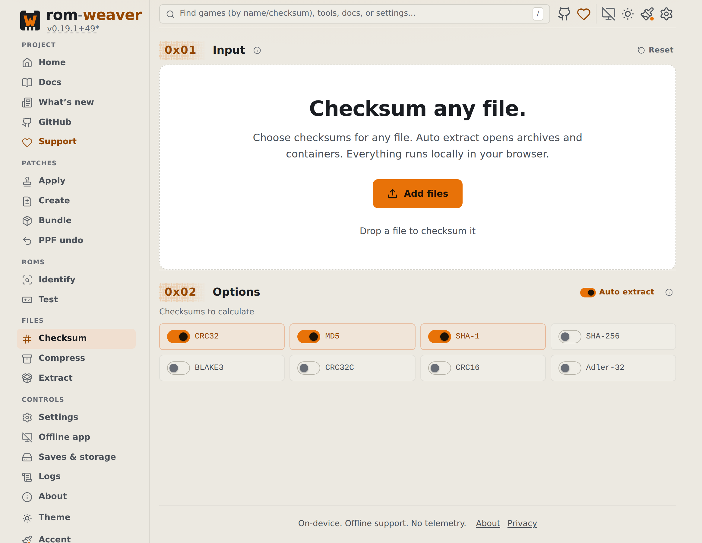
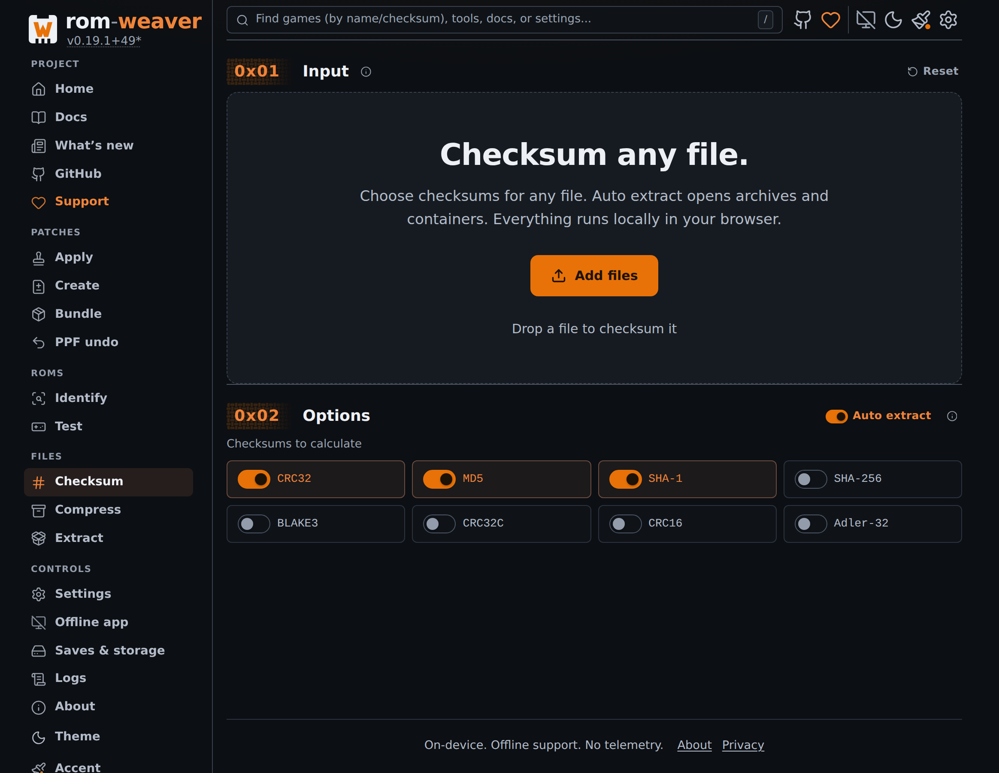
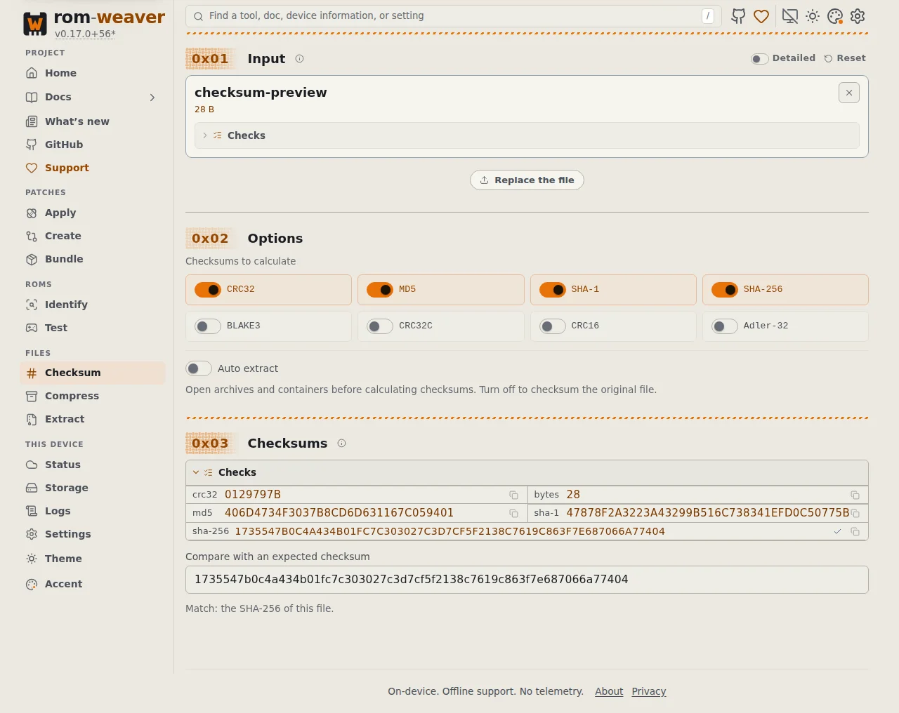

# Checksum a file in the browser

Calculate CRC32, MD5, SHA-1, and other file checksums in your browser, then compare them with an expected value. Your file stays on your device.

For ROM title lookup, use [Identify a ROM](identify-roms-browser.md). For terminal procedures, see [Hash a file](identify-and-hash-files.md#hash-a-file).

<!-- START doctoc -->
## Table of contents

- [Calculate checksums](#calculate-checksums)
- [Add an algorithm](#add-an-algorithm)
- [Compare with an expected checksum](#compare-with-an-expected-checksum)

<!-- END doctoc -->

## Calculate checksums

1. Open [Checksum file](https://rom-weaver.com/checksum).
2. Select the algorithms in **Options**. CRC32, MD5, and SHA-1 are selected by default.
3. Leave **Auto extract** checked to open archives and containers. Clear it to checksum the original file.
4. Add one file. If an archive contains several files, choose the file to check.
5. Wait for **Checksums** to show the results.

You can add a text file, patch, ROM, archive, or any other file. Select a checksum row to copy its value.

<figure class="docs-screenshot">
  <picture data-docs-screenshot-theme="light">
    <source media="(max-width: 520px)" type="image/avif" srcset="../screenshots/checksum-initial-mobile-light.avif" width="1170" height="2532">
    <source type="image/avif" srcset="../screenshots/checksum-initial-desktop-light.avif" width="2328" height="1800">
    <source media="(max-width: 520px)" type="image/webp" srcset="../screenshots/checksum-initial-mobile-light.webp" width="1170" height="2532">
    
  </picture>
  <picture data-docs-screenshot-theme="dark">
    <source media="(max-width: 520px)" type="image/avif" srcset="../screenshots/checksum-initial-mobile-dark.avif" width="1170" height="2532">
    <source type="image/avif" srcset="../screenshots/checksum-initial-desktop-dark.avif" width="2328" height="1800">
    <source media="(max-width: 520px)" type="image/webp" srcset="../screenshots/checksum-initial-mobile-dark.webp" width="1170" height="2532">
    
  </picture>
  <figcaption>Choose algorithms and extraction in Options before adding a file.</figcaption>
</figure>

## Add an algorithm

1. Select another algorithm, for example **SHA-256**.
2. Select **Calculate SHA-256**.

With **Auto extract** checked, an archive can ask you to select its file again. Each calculation uses one selected file for all displayed checksums.

To stop a calculation, cancel it from the progress bar. The previous results stay available.

The [checksum support table](../reference/formats.md#checksum-support) lists every algorithm.

## Compare with an expected checksum

1. Paste the expected value into **Compare with an expected checksum**.
2. Read the result under the field.

<figure class="docs-screenshot">
  <picture>
    <source media="(max-width: 520px)" type="image/webp" srcset="../screenshots/checksum-mobile-dark.webp" width="390" height="1200">
    
  </picture>
  <figcaption>A pasted SHA-256 matches the calculated value.</figcaption>
</figure>

A match names the algorithm. For ROMs with known headers or byte orders, a match can also name a transformed variant.

An 8-character or 64-character value can belong to several algorithms. If another algorithm is needed, select it and calculate it.

If no checksum matches, check that you selected the correct file and extraction setting.
