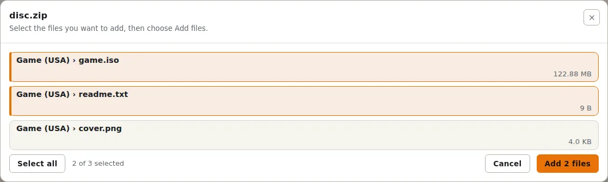
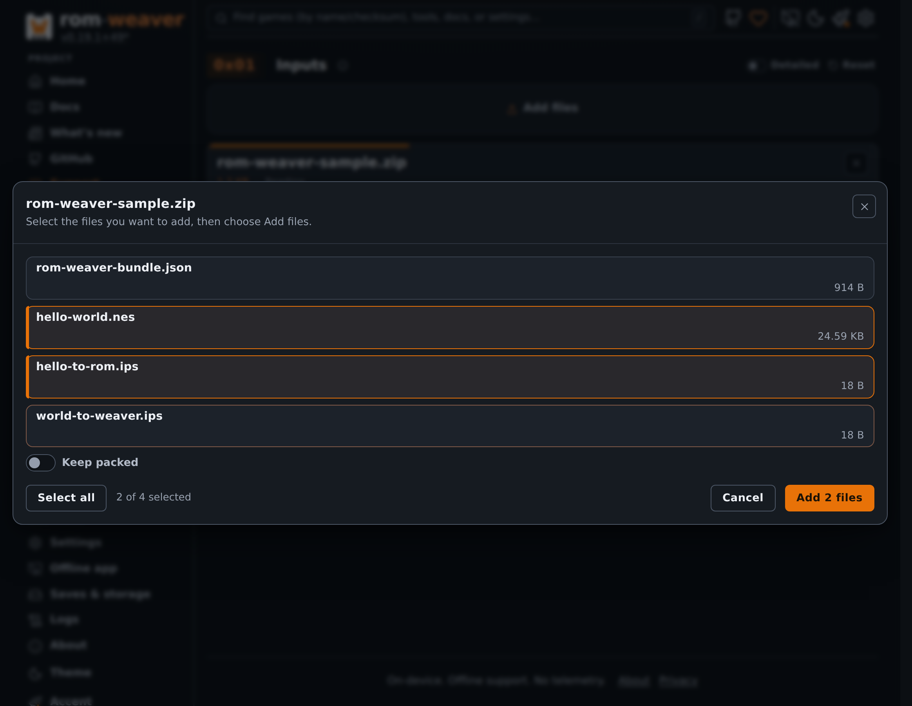
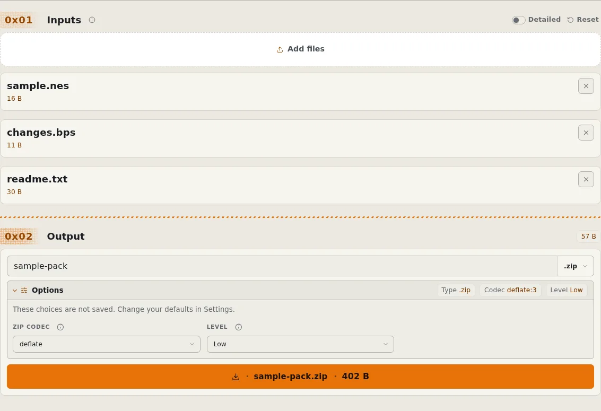
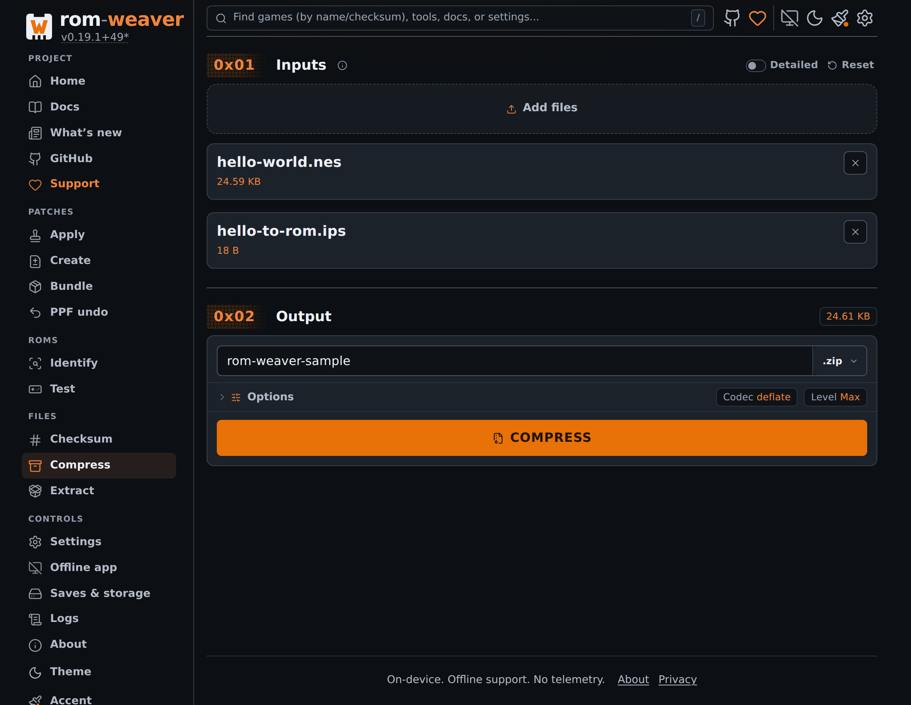

# Extract or compress files in the browser

Use Compress to package files in a ZIP or 7z archive. You can also create CHD, RVZ, or Z3DS images from compatible disc images and ROMs.

To take every file out of an archive, use [Extract files](extract-files-browser.md). For directory packaging, use the [CLI archive guide](work-with-archives.md).

For specific formats, use [ISO or BIN/CUE to CHD](convert-to-chd-browser.md), [ISO to RVZ](convert-to-rvz-browser.md), or [Nintendo 3DS to Z3DS](convert-to-z3ds-browser.md).

To decompress images, use [RVZ to ISO](convert-rvz-to-iso-browser.md) or [Extract Z3DS files](extract-z3ds-browser.md).

<!-- START doctoc -->
## Table of contents

- [Add files](#add-files)
- [Choose an output](#choose-an-output)
- [Check the result](#check-the-result)

<!-- END doctoc -->

## Add files

1. Open [Compress](https://rom-weaver.com/compress).
2. Add the files that you want to package or compress.
3. For a CUE disc, add the CUE file and every referenced track file.
4. When you add an archive or a compressed disc image, Compress lists the files inside it. Select the files to add, then select the **Add** button. Compress extracts only the selected files.
5. To add the archive itself without extracting it, turn on **Keep packed**, then select the **Add** button.

<figure class="docs-screenshot">
  <picture data-docs-screenshot-theme="light">
    <source media="(max-width: 520px)" type="image/avif" srcset="../screenshots/compress-select-files-mobile-light.avif" width="1170" height="2532">
    <source type="image/avif" srcset="../screenshots/compress-select-files-desktop-light.avif" width="2328" height="1800">
    <source media="(max-width: 520px)" type="image/webp" srcset="../screenshots/compress-select-files-mobile-light.webp" width="1170" height="2532">
    
  </picture>
  <picture data-docs-screenshot-theme="dark">
    <source media="(max-width: 520px)" type="image/avif" srcset="../screenshots/compress-select-files-mobile-dark.avif" width="1170" height="2532">
    <source type="image/avif" srcset="../screenshots/compress-select-files-desktop-dark.avif" width="2328" height="1800">
    <source media="(max-width: 520px)" type="image/webp" srcset="../screenshots/compress-select-files-mobile-dark.webp" width="1170" height="2532">
    
  </picture>
  <figcaption>Select the files inside an archive that you want to compress.</figcaption>
</figure>

ZIP and 7z accept arbitrary file sets. CHD accepts compatible disc images and ROMs. RVZ accepts GameCube and Wii ISO images. Z3DS accepts Nintendo 3DS images.

## Choose an output

1. Choose ZIP, 7z, CHD, RVZ, or Z3DS.
2. Enter the output filename without its extension.
3. Open **Options** to change the codec or compression level.
4. Select **Compress**, then select **Download** when the output is ready.

<figure class="docs-screenshot">
  <picture data-docs-screenshot-theme="light">
    <source media="(max-width: 520px)" type="image/avif" srcset="../screenshots/compress-mobile-light.avif" width="1170" height="2532">
    <source type="image/avif" srcset="../screenshots/compress-desktop-light.avif" width="2328" height="1800">
    <source media="(max-width: 520px)" type="image/webp" srcset="../screenshots/compress-mobile-light.webp" width="1170" height="2532">
    
  </picture>
  <picture data-docs-screenshot-theme="dark">
    <source media="(max-width: 520px)" type="image/avif" srcset="../screenshots/compress-mobile-dark.avif" width="1170" height="2532">
    <source type="image/avif" srcset="../screenshots/compress-desktop-dark.avif" width="2328" height="1800">
    <source media="(max-width: 520px)" type="image/webp" srcset="../screenshots/compress-mobile-dark.webp" width="1170" height="2532">
    
  </picture>
  <figcaption>Choose a format and compression options, then download the finished file.</figcaption>
</figure>

The format picker offers outputs that match the selected inputs. Renaming a filename extension does not convert its contents.

Compress does not apply patches. Use [Apply](apply-rom-patches.md) when you need to change ROM contents.

Only formats marked **Create** in the [container table](../reference/formats.md#container-and-compression-formats) can be output containers. A supported input is not necessarily a supported output.

## Check the result

Open a disc-image result with [Identify](identify-roms-browser.md) and compare the extracted ROM bytes with the original.

Test the result in the emulator or hardware you use before replacing your stored copy. Keep the source when changing disc layouts or using trimming.

[Choosing a compression format](../explanation/compression-formats.md) explains archive and disc-container differences.
