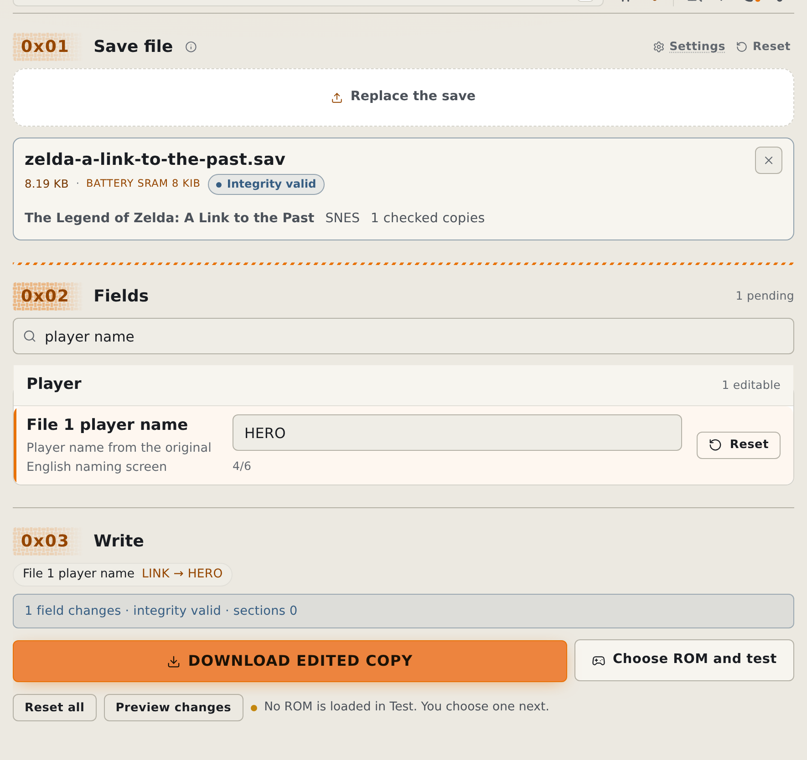
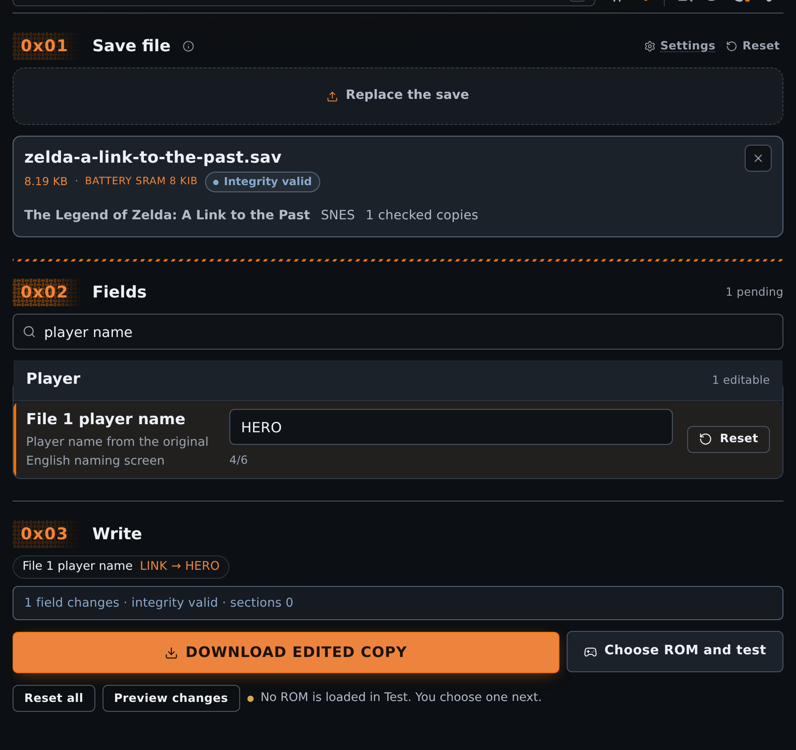

# Edit a game save in the browser

Change supported properties in a game save and download a separate copy. Keep the original until you test the result.

The [Save Editor support reference](../reference/save-editor.md) lists the exact games, layouts, and editable fields.

<!-- START doctoc -->
## Table of contents

- [Check the input file](#check-the-input-file)
- [Use the browser](#use-the-browser)
- [Test the edited copy](#test-the-edited-copy)
- [Read the recognition result](#read-the-recognition-result)
- [Understand the safety checks](#understand-the-safety-checks)
- [Supported and unsupported data](#supported-and-unsupported-data)
- [Keep the original file](#keep-the-original-file)
- [Use the CLI](#use-the-cli)
- [Related](#related)

<!-- END doctoc -->

## Check the input file

Export the game's battery save or SRAM from your emulator. Do not use an emulator save state.

Check the [supported games and input sizes](../reference/save-editor.md#supported-games). A matching size alone does not prove support.

The editor also accepts the [supported save containers](../reference/save-editor.md#save-containers). Keep their original extension when you restore the edited copy.

## Use the browser

1. [Enable beta tools](browser-settings.md#enable-beta-tools), then open [Saves](https://rom-weaver.com/save-editor).
2. Add the game save file.
3. Select the game if recognition asks for a choice.
4. Read the integrity results and warnings before you change any fields.
5. Use **Find a property** to find the field you need.
6. Change editable fields, then select **Preview changes**.
7. Check the change summary and select **Download edited copy**.

Filtering does not discard changes in hidden fields. Use [Create game saves](create-game-saves-browser.md) for a fresh supported save.

<figure class="docs-screenshot">
  <picture data-docs-screenshot-theme="light">
    <source media="(max-width: 520px)" type="image/avif" srcset="../screenshots/save-editor-mobile-light.avif" width="1170" height="2627">
    <source type="image/avif" srcset="../screenshots/save-editor-desktop-light.avif" width="1770" height="1669">
    <source media="(max-width: 520px)" type="image/webp" srcset="../screenshots/save-editor-mobile-light.webp" width="1170" height="2627">
    
  </picture>
  <picture data-docs-screenshot-theme="dark">
    <source media="(max-width: 520px)" type="image/avif" srcset="../screenshots/save-editor-mobile-dark.avif" width="1170" height="2627">
    <source type="image/avif" srcset="../screenshots/save-editor-desktop-dark.avif" width="1770" height="1669">
    <source media="(max-width: 520px)" type="image/webp" srcset="../screenshots/save-editor-mobile-dark.webp" width="1170" height="2627">
    
  </picture>
  <figcaption>A generated Zelda save, filtered to one property, with an edit preview. The original stays unchanged.</figcaption>
</figure>

## Test the edited copy

1. Select **Choose ROM and test** after the edit passes its checks.
2. On Test, add the ROM for the same game and revision.
3. Check that the game loads your progress and that the changed properties work.

If Test already has a compatible ROM, **Test save in ROM** reloads it with the edited save.

The browser keeps one pending test save across reloads. It clears that copy after a ROM opens with it or you select **Discard save**.

The compatibility check covers the platform and a linked ROM hash when available. Without that hash, check the game title yourself.

For another emulator, back up its current save, then import the downloaded copy with that emulator's save-import control.

## Read the recognition result

Choose the correct game when recognition is ambiguous. Do not force a different title to make an unsupported save appear editable.

The [recognition reference](../reference/save-editor.md#recognition) describes paired layouts and the result values.

## Understand the safety checks

Stop if integrity checks block editing. Restore a known-good backup; the editor does not repair damaged sections.

The [integrity reference](../reference/save-editor.md#integrity-rules) describes the checks for each game family.

## Supported and unsupported data

Check the [field tables](../reference/save-editor.md#editable-fields) before an edit. Support for a container or platform does not imply support for every game.

## Keep the original file

Keep a separate original backup. If the edited copy fails to load, restore it and record the game choice and integrity result.

## Use the CLI

[Edit a game save from the CLI](cli-save.md) covers terminal inspection, previews, and writing an edited copy.

## Related

- [Test a ROM](test-roms-in-browser.md): game saves, save states, and backups.
- [Save Editor support](../reference/save-editor.md): exact limits and integrity rules.
- [Save Editor development](../development/save-editor.md): handler architecture and contributor flow.
