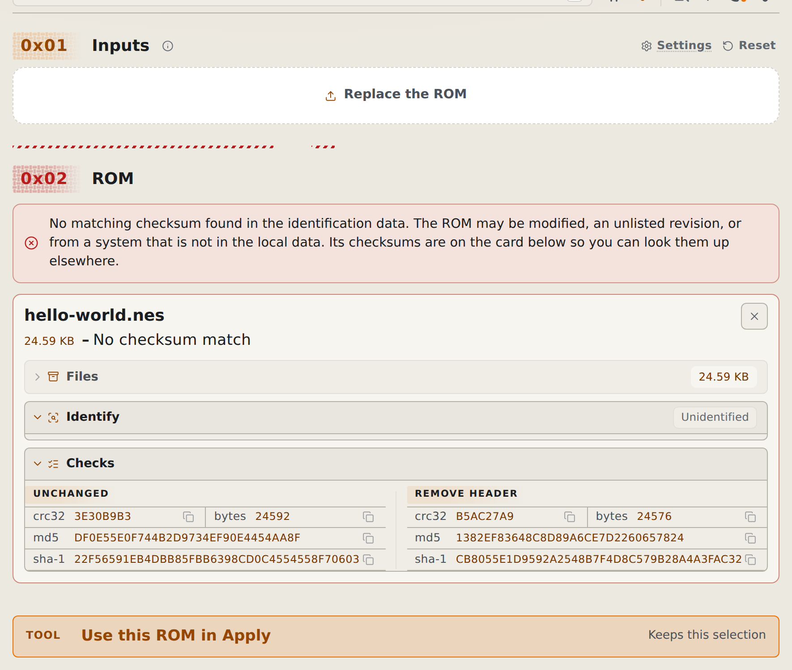
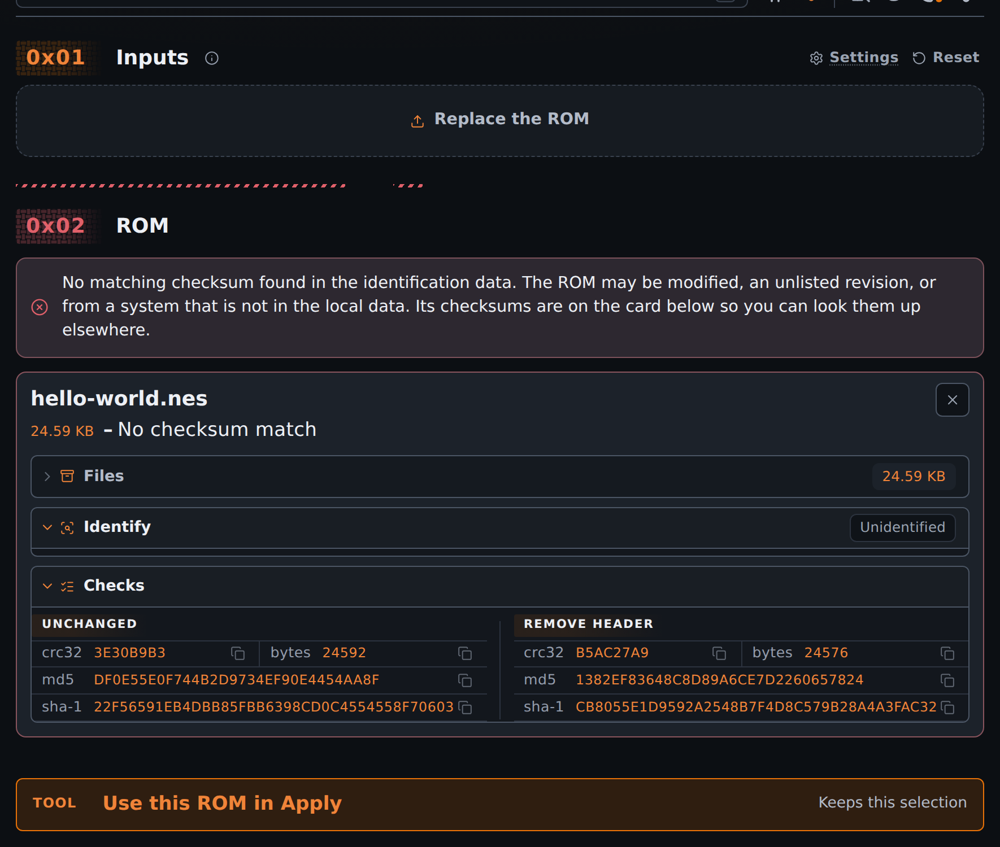

# Identify and check a ROM in the browser

Use Identify to find a game's known name, region, revision, and checksums. Your file stays on your device.

<!-- START doctoc -->
## Table of contents

- [Identify a file](#identify-a-file)
- [Search without a file](#search-without-a-file)
- [Compare a checksum](#compare-a-checksum)

<!-- END doctoc -->

## Identify a file

1. Open [Identify](https://rom-weaver.com/identify-rom).
2. Add your ROM or a supported archive.
3. Wait for identification to finish.
4. Read the **Identify** and **Checks** drawers on the ROM card.

An archive can produce several results. Each result names its member so you can tell which ROM it describes.

An unknown result means no matching checksum was found in the available data. It does not prove that your file is corrupt. Homebrew, modified ROMs, and unlisted releases can be unknown.

If several records share the checksums, read every candidate. If identification data could not load, check your connection and select **Retry identification**.

<figure class="docs-screenshot">
  <picture data-docs-screenshot-theme="light">
    <source media="(max-width: 520px)" type="image/avif" srcset="../screenshots/identify-checks-mobile-light.avif" width="1170" height="2321">
    <source type="image/avif" srcset="../screenshots/identify-checks-desktop-light.avif" width="1770" height="1500">
    <source media="(max-width: 520px)" type="image/webp" srcset="../screenshots/identify-checks-mobile-light.webp" width="1170" height="2321">
    
  </picture>
  <picture data-docs-screenshot-theme="dark">
    <source media="(max-width: 520px)" type="image/avif" srcset="../screenshots/identify-checks-mobile-dark.avif" width="1170" height="2321">
    <source type="image/avif" srcset="../screenshots/identify-checks-desktop-dark.avif" width="1770" height="1500">
    <source media="(max-width: 520px)" type="image/webp" srcset="../screenshots/identify-checks-mobile-dark.webp" width="1170" height="2321">
    
  </picture>
  <figcaption>An unknown ROM still has checksums. This example uses the supplied homebrew ROM.</figcaption>
</figure>

## Search without a file

1. Open a fresh [Identify page](https://rom-weaver.com/identify-rom).
2. Enter a checksum or game name in **Identify by checksum or game name**.
3. For a name search, select the game, then its release.
4. Read the expected ROM's details. Add your file to compare it with that expectation.

Search finds database records. It does not download a game. A name match alone does not prove that you have the right revision.

## Compare a checksum

Open **Checks** on the ROM card. Compare the same algorithm with the value in the patch author's notes. Select a checksum row to copy it.

For an archive, these checks describe the ROM inside it. A checksum for the ZIP itself is different.

Some cards include variants, such as a ROM without its copier header. Compare the form the author specifies. If the values differ, follow [Fix a checksum error](fix-checksum-errors.md).

For data sources and offline requirements, see [Where identify data comes from](../explanation/identify-sources.md). Terminal procedures are in [Identify and hash ROMs from the CLI](identify-and-hash-files.md).
