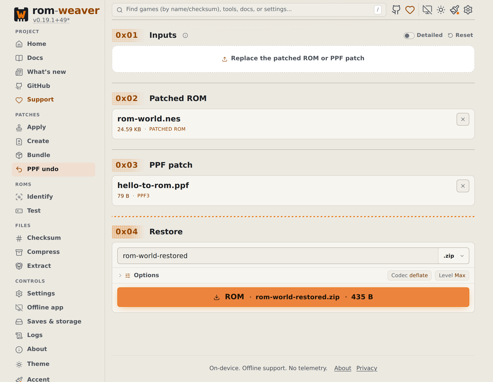
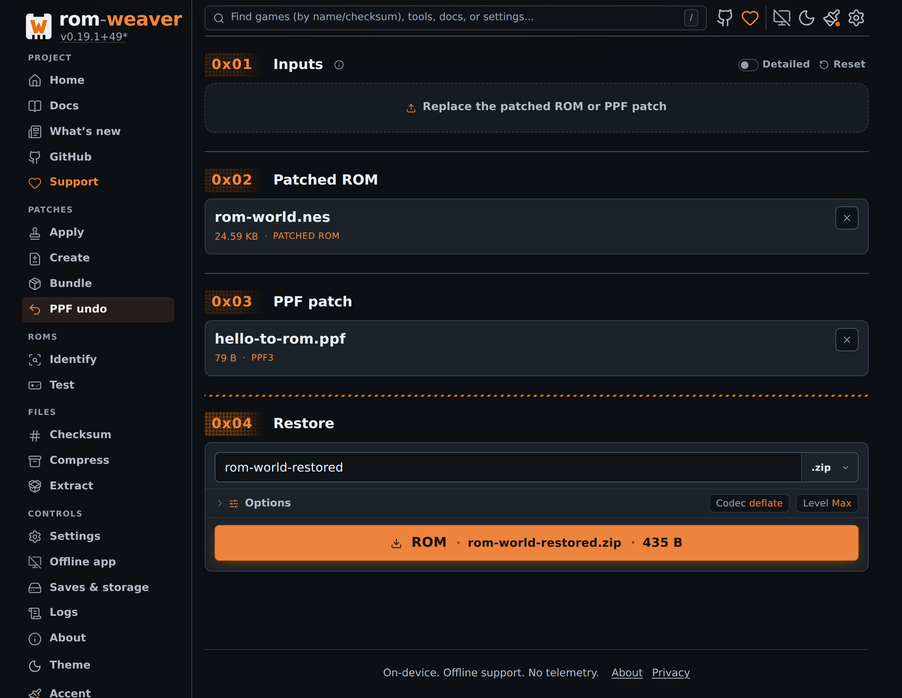

# Undo a PPF patch in the browser

Use PPF Undo with the patched ROM and the exact PPF3 patch that changed it. The patch must contain undo data.

This tool cannot undo arbitrary patches or reconstruct bytes absent from the patch.

<!-- START doctoc -->
## Table of contents

- [Restore the saved bytes](#restore-the-saved-bytes)
- [Check the restored copy](#check-the-restored-copy)

<!-- END doctoc -->

## Restore the saved bytes

1. Open [PPF Undo](https://rom-weaver.com/ppf-undo).
2. Add the patched ROM and the original `.ppf` patch. You can add archives containing either or both.
3. If an archive contains several candidates, choose the ROM and PPF patch to use. Check the **Patched ROM** and **PPF patch** cards and any warnings about ignored inputs.
4. Enter a separate output filename. Choose its format in **Restore**; open **Options** to adjust compression.
5. Select **Restore original ROM**.

<figure class="docs-screenshot">
  <picture data-docs-screenshot-theme="light">
    <source media="(max-width: 520px)" type="image/avif" srcset="../screenshots/ppf-undo-mobile-light.avif" width="1170" height="2532">
    <source type="image/avif" srcset="../screenshots/ppf-undo-desktop-light.avif" width="2328" height="1800">
    <source media="(max-width: 520px)" type="image/webp" srcset="../screenshots/ppf-undo-mobile-light.webp" width="1170" height="2532">
    
  </picture>
  <picture data-docs-screenshot-theme="dark">
    <source media="(max-width: 520px)" type="image/avif" srcset="../screenshots/ppf-undo-mobile-dark.avif" width="1170" height="2532">
    <source type="image/avif" srcset="../screenshots/ppf-undo-desktop-dark.avif" width="2328" height="1800">
    <source media="(max-width: 520px)" type="image/webp" srcset="../screenshots/ppf-undo-mobile-dark.webp" width="1170" height="2532">
    
  </picture>
  <figcaption>PPF Undo restores the bytes saved in the patch.</figcaption>
</figure>

If an input is invalid, replace it before restoring. If the patch lacks undo data, use your clean backup. The tool cannot recover changes from other patches applied afterward.

## Check the restored copy

Compare the restored file's checksum with the known original using [Identify](identify-roms-browser.md#compare-a-checksum). Test the copy before replacing any file.

For the terminal command, see [CLI tools](../reference/cli.md#tools). [PPF background](../explanation/patch-formats.md#ppf) explains the format.
