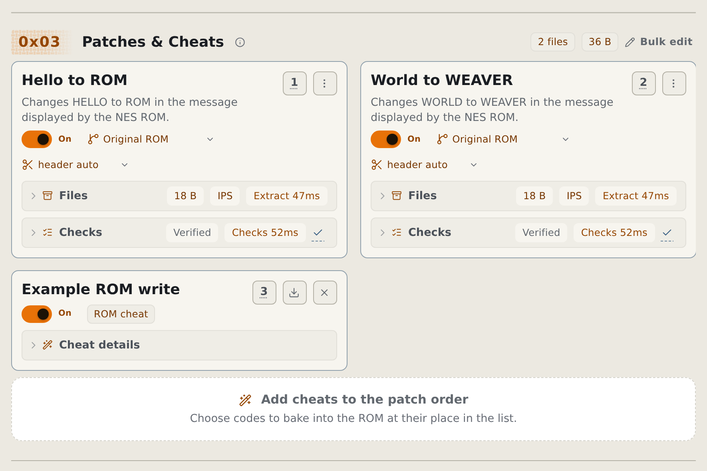
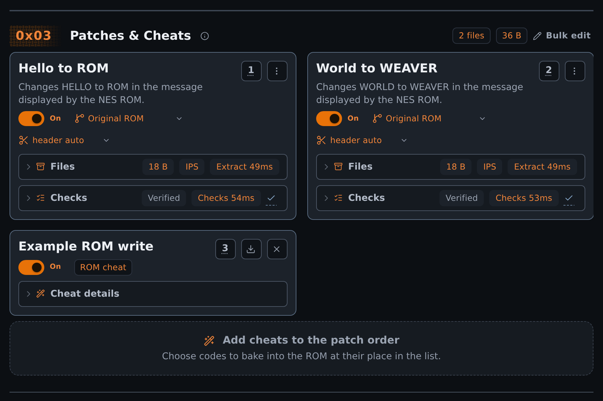

# Use cheats in the browser

Add supported cheat codes to the Apply workflow. The output ROM contains the changes; it does not need a running cheat engine.

Apply cheats do not need beta mode. Cheat-code creation on the Create page does.

<!-- START doctoc -->
## Table of contents

- [Add cheats to a ROM](#add-cheats-to-a-rom)
- [Add a code manually](#add-a-code-manually)
- [Save a ROM cheat as a patch](#save-a-rom-cheat-as-a-patch)
- [Create a patch from cheat codes](#create-a-patch-from-cheat-codes)
- [Use the database offline](#use-the-database-offline)

<!-- END doctoc -->

## Add cheats to a ROM

1. Add the original ROM to the **Apply** page.
2. In **Patches & Cheats**, select **Add cheats to the patch order**.
3. Choose the system and game if the dialog asks.
4. Search the list and add the cheats you want.
5. Close the dialog and check the selected cheats in the patch order.
6. Move each cheat before or after the patches that it must use.
7. Start **Apply** and save the output ROM.

Check the game and revision yourself when the database only matches a title. A title match is not an exact ROM match.

Unsupported codes show a reason and cannot be selected. Resolve reported write conflicts before Apply; do not assume the last code wins.

Use each card's inclusion control to leave a step out without removing it. Patch and cheat order both affect the result.

<figure class="docs-screenshot">
  <picture data-docs-screenshot-theme="light">
    <source media="(max-width: 520px)" type="image/avif" srcset="../screenshots/cheat-step-mobile-light.avif" width="1170" height="2141">
    <source type="image/avif" srcset="../screenshots/cheat-step-desktop-light.avif" width="1770" height="1180">
    <source media="(max-width: 520px)" type="image/webp" srcset="../screenshots/cheat-step-mobile-light.webp" width="1170" height="2141">
    
  </picture>
  <picture data-docs-screenshot-theme="dark">
    <source media="(max-width: 520px)" type="image/avif" srcset="../screenshots/cheat-step-mobile-dark.avif" width="1170" height="2141">
    <source type="image/avif" srcset="../screenshots/cheat-step-desktop-dark.avif" width="1770" height="1180">
    <source media="(max-width: 520px)" type="image/webp" srcset="../screenshots/cheat-step-mobile-dark.webp" width="1170" height="2141">
    
  </picture>
  <figcaption>Cheats occupy numbered steps beside patches. This homebrew example demonstrates the controls, not a recommended gameplay code.</figcaption>
</figure>

## Add a code manually

1. Open **Add cheats to the patch order**, then **Add code manually**.
2. Enter the code and an optional description.
3. Keep automatic system and code-type detection, or select an override.
4. Select **Check code**, then read the detected system, code type, and delivery result.
5. Add the code when the result matches your game.

Codes with unresolved `?` or `X` placeholders cannot be added. Codes that need live game memory cannot become ROM changes.

## Save a ROM cheat as a patch

1. Add a supported cheat to the patch order.
2. Open that card's download menu and select **Save as patch**.
3. Save the downloaded patch file.

The status names the output file. The [cheat reference](../reference/cheat-database.md#patch-export) lists the automatic export format limits.

## Create a patch from cheat codes

1. [Enable beta tools](browser-settings.md#enable-beta-tools), then add the original ROM on **Create**.
2. Select **Cheat codes** on the **Modified** step.
3. Enter one code per line, or join codes with `+`.
4. Check the detected system, code type, and write count.
5. Check each code's write list and its `compare` badge.
6. Select the patch format and file name on **Patch**.
7. Select **Create & download patch**.

**Pick from the cheat database** offers the same database as Apply. A code that cannot become ROM writes blocks creation and states its reason.

## Use the database offline

Follow [Prepare for offline use](browser-settings.md#prepare-for-offline-use). Wait for the built-in identify and cheat databases to finish installing before you disconnect.

For the baking model, see [ROM cheats](../explanation/rom-cheats.md). For exact system and matching limits, see the [cheat reference](../reference/cheat-database.md).
