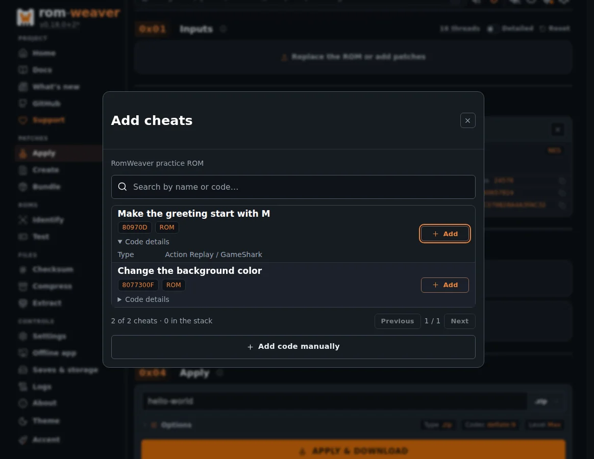
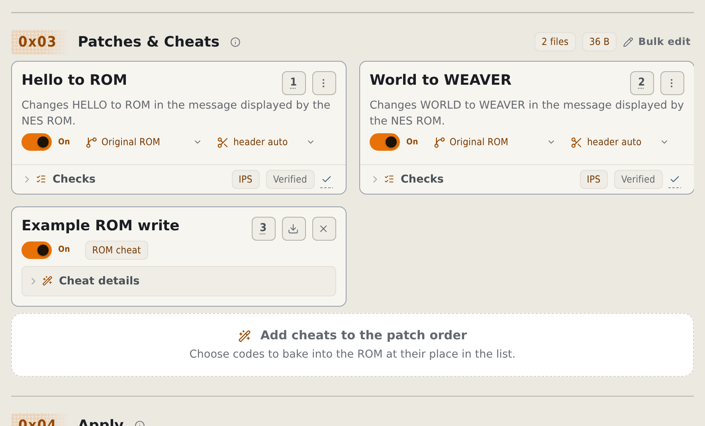
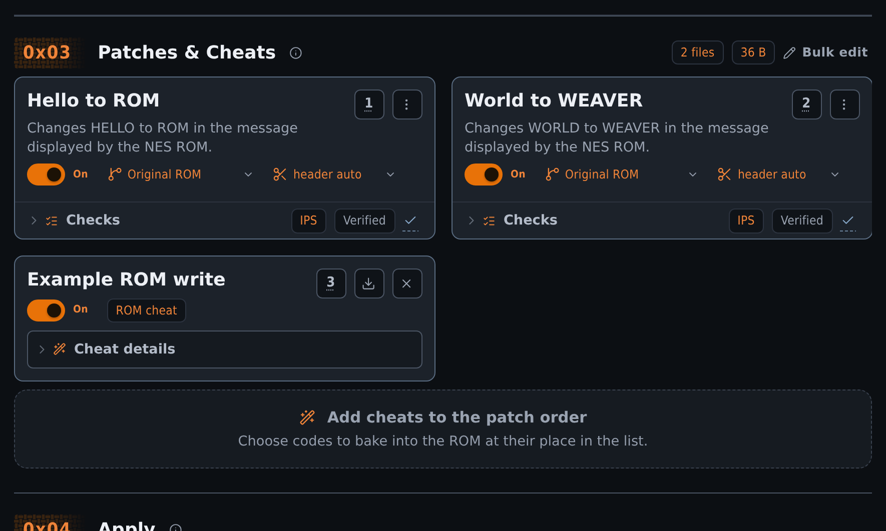
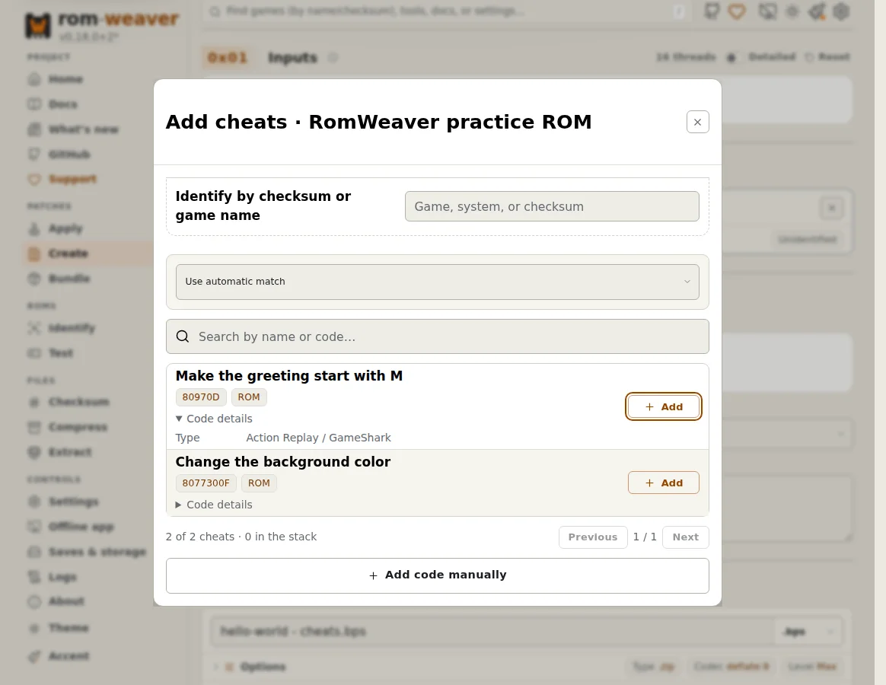
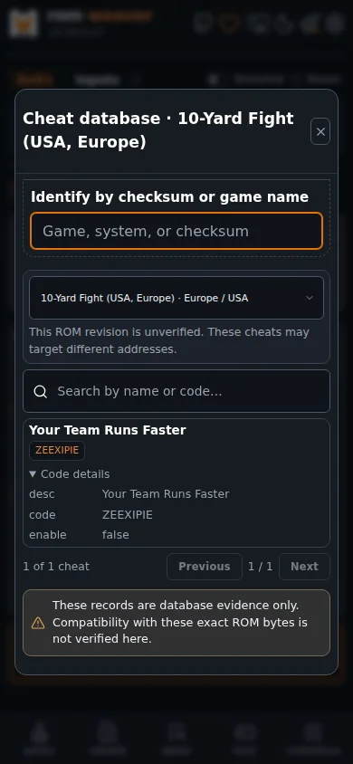

# Use cheats in the browser

Add supported cheat codes to the Apply workflow. The output ROM contains the changes; it does not need a running cheat engine.

The same cheat picker is available in Apply and Create. Identify lets you inspect known codes without changing a ROM.

<!-- START doctoc -->
## Table of contents

- [Add cheats to a ROM](#add-cheats-to-a-rom)
- [Add a code manually](#add-a-code-manually)
- [Save a ROM cheat as a patch](#save-a-rom-cheat-as-a-patch)
- [Create a patch from cheat codes](#create-a-patch-from-cheat-codes)
- [Inspect cheats without changing a ROM](#inspect-cheats-without-changing-a-rom)
- [Use the database offline](#use-the-database-offline)

<!-- END doctoc -->

## Add cheats to a ROM

The [guided Apply cheats tour](https://rom-weaver.com/apply-patches?guide=apply-cheats) uses a supplied homebrew ROM and a working practice code.

The picker includes **Make the greeting start with M** (`80970D`) and **Change the background color** (`8077300F`). These are practice codes for the supplied homebrew ROM only.

<figure class="docs-screenshot">
  <picture>
    <source media="(max-width: 520px)" srcset="../screenshots/cheat-apply-cheats-mobile-light.webp" width="390" height="844">
    
  </picture>
  <figcaption>The shared picker lists practice codes for the supplied ROM.</figcaption>
</figure>

1. Add the original ROM to the **Apply** page.
2. In **Patches & Cheats**, select **Add cheats to the patch order**.
3. Choose the system and game if the dialog asks.
4. Search the list and add the cheats you want.
5. Close the dialog and check the selected cheats in the patch order.
6. Move each cheat before or after the patches that it must use.
7. Start **Apply** and save the output ROM.

Check the game and revision yourself when the database only matches a title. A title match is not an exact ROM match.

Unsupported codes show a reason and cannot be selected. Resolve reported write conflicts before Apply; do not assume the last code wins.

Use each card's inclusion control to leave a step out without removing it. Patch and cheat order both affect the result.

<figure class="docs-screenshot">
  <picture data-docs-screenshot-theme="light">
    <source media="(max-width: 520px)" type="image/avif" srcset="../screenshots/cheat-step-mobile-light.avif" width="1170" height="2141">
    <source type="image/avif" srcset="../screenshots/cheat-step-desktop-light.avif" width="1770" height="1180">
    <source media="(max-width: 520px)" type="image/webp" srcset="../screenshots/cheat-step-mobile-light.webp" width="1170" height="2141">
    
  </picture>
  <picture data-docs-screenshot-theme="dark">
    <source media="(max-width: 520px)" type="image/avif" srcset="../screenshots/cheat-step-mobile-dark.avif" width="1170" height="2141">
    <source type="image/avif" srcset="../screenshots/cheat-step-desktop-dark.avif" width="1770" height="1180">
    <source media="(max-width: 520px)" type="image/webp" srcset="../screenshots/cheat-step-mobile-dark.webp" width="1170" height="2141">
    
  </picture>
  <figcaption>Cheats occupy numbered steps beside patches. This homebrew example demonstrates the controls, not a recommended gameplay code.</figcaption>
</figure>

## Add a code manually

1. Open **Add cheats to the patch order**, then **Add code manually**.
2. Enter the code and an optional description.
3. Keep automatic system and code-type detection, or select an override.
4. Select **Check code**, then read the detected system, code type, and delivery result.
5. Add the code when the result matches your game.

Select Pro Action Rocky explicitly for an eight-digit NES code. For a GBA code, select the exact GameShark or Action Replay version. Select a `raw` version only for an already decrypted block. Keep all lines of a versioned GBA block together.

Codes with unresolved `?` or `X` placeholders cannot be added. Gold Finger `XX` trailing data slots are valid unused bytes. Codes that need live game memory cannot become ROM changes.

## Save a ROM cheat as a patch

1. Add a supported cheat to the patch order.
2. Open that card's download menu and select **Save as patch**.
3. Save the downloaded patch file.

The status names the output file. The [cheat reference](../reference/cheat-database.md#patch-export) lists the automatic export format limits.

## Create a patch from cheat codes

The [guided Create cheats tour](https://rom-weaver.com/create-patch?guide=create-cheats) makes a patch from a working code and the supplied homebrew ROM.

1. Add the original ROM on **Create**.
2. Select **Cheat codes** on the **Modified** step.
3. Enter one code per line, or join codes with `+`.
4. Select **Pick from the cheat database** to use the same picker as Apply.
5. Check the detected system, code type, and write count.
6. Check each code's write list and its `compare` badge.
7. Select the patch format and file name on **Patch**.
8. Select **Create & download patch**.

**Pick from the cheat database** offers the same database as Apply. A code that cannot become ROM writes blocks creation and states its reason.

<figure class="docs-screenshot">
  
  <figcaption>Create uses the same picker to add codes to its input.</figcaption>
</figure>

## Inspect cheats without changing a ROM

1. Add a ROM or archive on **Identify**.
2. Select **View cheats** on the matching result or expected-ROM candidate.
3. Search the matched game's known codes.
4. Open **Code details** to inspect the original database fields and import warnings.

Identify shows inspection data only. It can list checksum-only and archive candidates without claiming that a code is compatible with the selected bytes. Use Apply or Create to classify and use a code.

<figure class="docs-screenshot">
  
  <figcaption>Identify shows database evidence without changing a ROM.</figcaption>
</figure>

## Use the database offline

Follow [Prepare for offline use](browser-settings.md#prepare-for-offline-use). Wait for the built-in identify and cheat databases to finish installing before you disconnect.

For the baking model, see [ROM cheats](../explanation/rom-cheats.md). For exact system and matching limits, see the [cheat reference](../reference/cheat-database.md).
