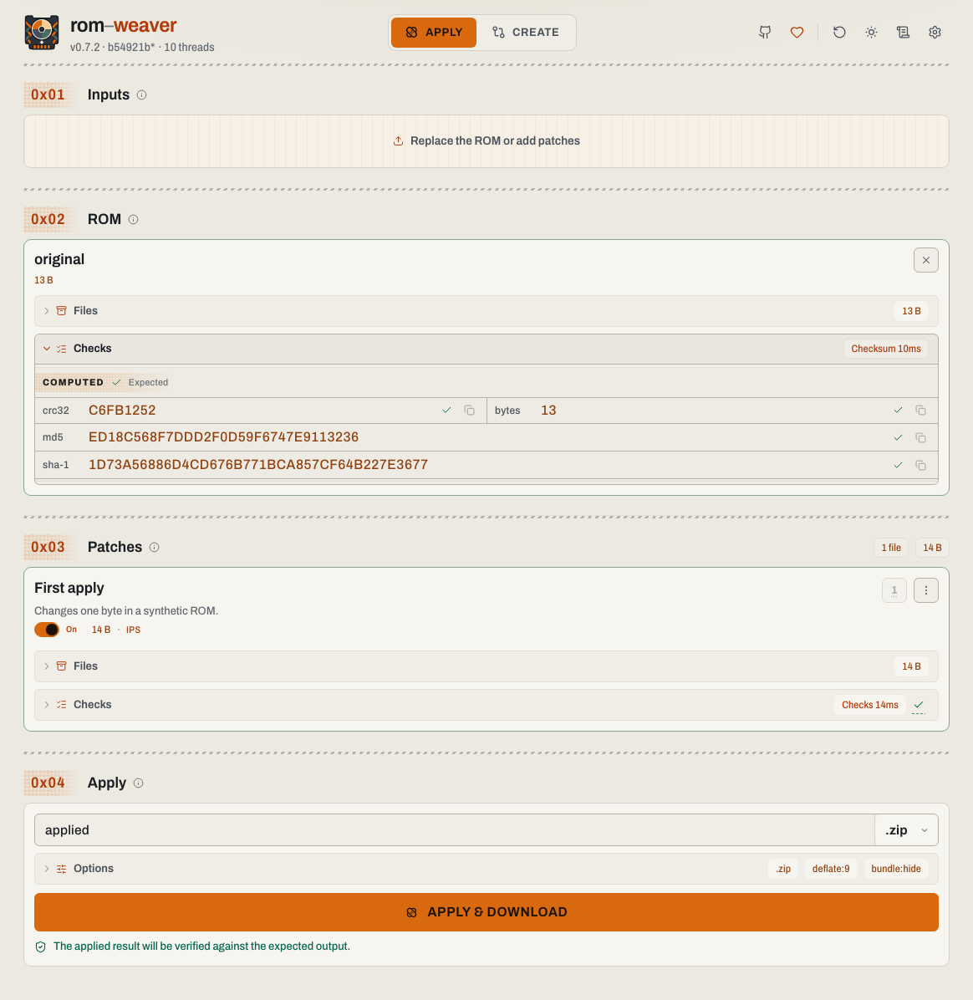
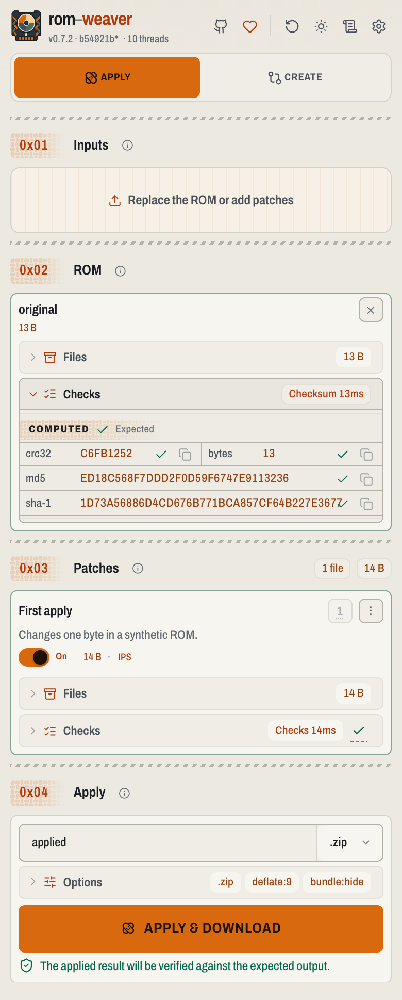

# Screenshots

<!-- START doctoc -->
## Table of contents

- [Desktop](#desktop)
  - [Apply patches](#apply-patches)
  - [Create a patch](#create-a-patch)
- [Mobile](#mobile)
  - [Apply patches](#apply-patches-1)
  - [Create a patch](#create-a-patch-1)

<!-- END doctoc -->

## Desktop

### Apply patches

<picture>
  <source media="(prefers-color-scheme: dark)" srcset="../packages/rom-weaver-webapp/design/apply-desktop-dark.png">
  
</picture>

### Create a patch

<picture>
  <source media="(prefers-color-scheme: dark)" srcset="../packages/rom-weaver-webapp/design/create-desktop-dark.png">
  
</picture>

## Mobile

### Apply patches

  <picture>
    <source media="(prefers-color-scheme: dark)" srcset="../packages/rom-weaver-webapp/design/apply-mobile-dark.png">
    
  </picture>

### Create a patch

  <picture>
    <source media="(prefers-color-scheme: dark)" srcset="../packages/rom-weaver-webapp/design/create-mobile-dark.png">
    
  </picture>

