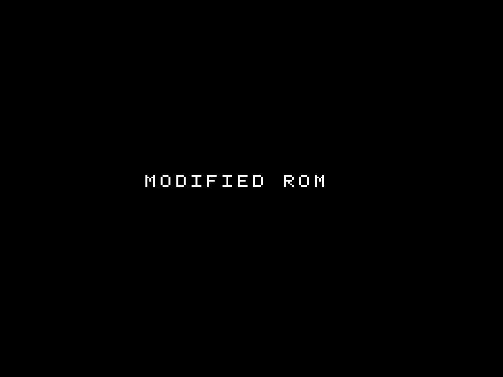

# Your first apply in the terminal

Run a complete patch job in the terminal with the same tiny homebrew ROMs the webapp uses, then practice creating a patch and packaging it as a shareable bundle. Nothing here needs a real ROM; every asset is downloadable and safe.

Install first if you have not: [Install the CLI](../how-to/install-cli.md).

<!-- START doctoc -->
## Table of contents

- [First apply](#first-apply)
- [Practice patch creation and bundles](#practice-patch-creation-and-bundles)
- [What you learned](#what-you-learned)
- [Next](#next)

<!-- END doctoc -->

## First apply


Run a complete patch with the tiny original homebrew NES ROM the webapp uses. The download holds the ROM, the patch, and the checksum the result should have, so there is nothing else to supply.

```bash
curl --fail --location --output first-weave.zip https://rom-weaver.com/first-weave.zip
rom-weaver patch apply --input first-weave.zip --output modified-rom.nes
rom-weaver checksum --input modified-rom.nes --algo sha256
```

The original ROM displays `HELLO WORLD`; the first IPS patch changes `HELLO` to `MODIFIED`, and the second changes `WORLD` to `ROM`. The final ROM displays `MODIFIED ROM`. The final SHA-256 should be `e0db7cbd02cccd5e83931e7974db94aaafe40327b2a33fdd4c83235c9880a90e`. Open the result in an NES emulator to run it.

| Original ROM | After the first patch | After both patches |
| :---: | :---: | :---: |
|  |  |  |

## Practice patch creation and bundles


Use the two loose homebrew ROMs from guided Create. The first is the clean Original. The second is Modified:

```bash
curl --fail --location --output hello-world.nes \
  https://rom-weaver.com/hello-world.nes
curl --fail --location --output modified-world.nes \
  https://rom-weaver.com/modified-world.nes
```

Create a BPS patch, apply the downloaded artifact to the clean Original, and checksum the rebuilt file:

```bash
rom-weaver patch create \
  --original hello-world.nes \
  --modified modified-world.nes \
  --output sample.bps
rom-weaver patch apply \
  --input hello-world.nes \
  --patch sample.bps \
  --output rebuilt.nes
rom-weaver checksum --input rebuilt.nes --algo sha256
```

The final SHA-256 should be `f203a199694d5a67a43857ce7e37a79e14a9fa1e7554ddd316b84f8df508b45e`. That match proves the patch rebuilt Modified byte for byte.

Now package that tested patch as a public-safe bundle. `--no-bundle-rom` keeps the Original out of the ZIP while recording its checksums:

```bash
rom-weaver bundle create \
  --input hello-world.nes \
  --patch sample.bps \
  --patch-id sample \
  --patch-name "HELLO to MODIFIED" \
  --expect-out sha256=f203a199694d5a67a43857ce7e37a79e14a9fa1e7554ddd316b84f8df508b45e \
  --output rom-weaver-bundle.json \
  --bundle sample-bundle.zip \
  --no-bundle-rom
```

Test the finished archive from the same clean Original:

```bash
rom-weaver patch apply \
  --input hello-world.nes \
  --bundle sample-bundle.zip \
  --output bundle-rebuilt.nes \
  --no-compress
rom-weaver checksum --input bundle-rebuilt.nes --algo sha256
```

The result should have the same `f203a1…b45e` SHA-256. This sequence uses the same generated assets as the browser tours, so both interfaces start from identical bytes.

## What you learned

You applied a patch chain, created and tested a patch of your own, and packaged it as a bundle - the three jobs the CLI exists for. A real release differs only in which files you point at.

## Next

- [Apply patches from the CLI](../how-to/cli-apply.md): patch order, headers, byte order, checksum checks, and validation.
- [Create patches from the CLI](../how-to/cli-create.md): build and test a patch for release.
- [Bundles from the CLI](../how-to/cli-bundles.md): package patches into a repeatable, verifiable recipe.
- [CLI reference](../reference/cli.md): the command map, global behavior, and output formats.
- [How patching works](../explanation/how-patching-works.md): what these checksums actually prove.
