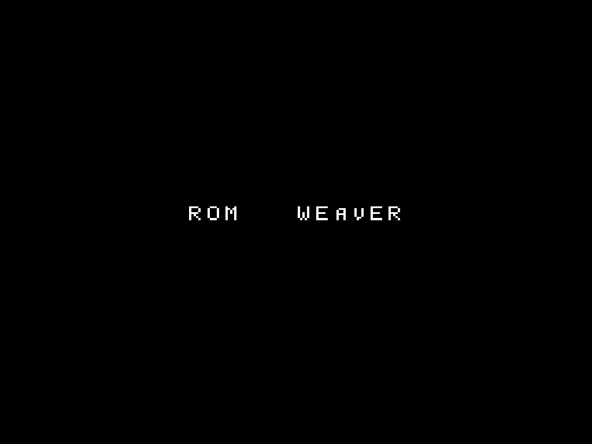

# Your first patch in the browser

Patch a supplied homebrew ROM in your browser, then check the downloaded result. You need nothing but a browser: no install, no account, and no files of your own.

The guide supplies the sample files when you ask for them; it does not load anything on its own.

<!-- START doctoc -->
## Table of contents

- [What you are about to do](#what-you-are-about-to-do)
- [Step 1: open the guide and add the practice files](#step-1-open-the-guide-and-add-the-practice-files)
- [Step 2: look at what you added](#step-2-look-at-what-you-added)
- [Step 3: apply the patches](#step-3-apply-the-patches)
- [Step 4: check that you got the right bytes](#step-4-check-that-you-got-the-right-bytes)
- [Step 5: try the other two samples](#step-5-try-the-other-two-samples)
- [Step 6: try a cheat-code sample](#step-6-try-a-cheat-code-sample)
- [If something looked different](#if-something-looked-different)
- [What you learned](#what-you-learned)
- [Next](#next)

<!-- END doctoc -->

## What you are about to do

A patch is a small file that describes changes to one exact version of a game. rom-weaver combines your game file and the patch into a new file, and leaves your original alone.

That is all you need to know to start. [How patching works](../explanation/how-patching-works.md) explains the rest once you have seen it happen.

## Step 1: open the guide and add the practice files

Open [guided Apply Patches](https://rom-weaver.com/apply-patches?guide=apply).

The guide opens on **Add your files**, the drop area every file goes through. It lists the ways in: drop files or a whole folder, drop a ZIP, 7z, or bundle, or choose **Add files** to pick them. **Continue** waits until a ROM and at least one patch are in.

For this tutorial, choose **Use the practice files** on the guide card. That adds a tiny homebrew NES ROM and two patches written for this guide. To add them the way you would add your own, choose **Download first-weave.zip** instead, then drop the ZIP on the drop area. Nothing is uploaded, and no commercial game data is involved.

## Step 2: look at what you added

The guide points at three more parts of the Apply page. Each tip has a **Try it** line with one thing to do. Use **Continue** to move on, then **Done** to close the guide.

1. **Check your starting ROM** frames the **ROM** card, which lists the file's checksums, and lifts the **Detailed** switch beside it. Turn it on and the card gains **Files** and **Identify** drawers; turn it off to keep one **Checks** drawer per file. Either view works for this tutorial.
2. **Patches and cheats** shows two independent changes. One changes `HELLO` to `ROM`. The other changes `WORLD` to `WEAVER`. Cheats join the same list from **Add cheats to the patch order**; leave every cheat off to preserve this tutorial's expected output.
3. **Apply** controls the output.

## Step 3: apply the patches

In **Apply**, select **.nes** in **Output format**, then choose **APPLY & DOWNLOAD**.

This downloads the ROM itself, not a ZIP archive. The checksum in the next step describes that ROM.

Your browser downloads a new ROM. The sample ROM you started from is untouched.

<figure class="docs-screenshot-pair" aria-label="The practice ROM before and after both patches">
  <figure class="docs-screenshot">
    
    <figcaption>Before: the clean practice ROM.</figcaption>
  </figure>
  <figure class="docs-screenshot">
    
    <figcaption>After: both patches applied.</figcaption>
  </figure>
</figure>

## Step 4: check that you got the right bytes

1. Keep the downloaded ROM, then open [Identify](https://rom-weaver.com/identify-rom).
2. Add the downloaded ROM and wait for checksumming to finish.
3. Open **Checks** on its ROM card and compare its SHA-1 with the value below.

The finished sample displays `ROM WEAVER`. Its SHA-1 is:

```text
844b844c845dc99aa4f13a83b6c9cf639684ae8a
```

For a tool that reports SHA-256, the same file has this value:

```text
7ac8001dcbcbff45cd5cebb5b0655192021fbbdf27533aa961347194ab3e836e
```

A match checks that you downloaded the expected result. [Checksums](../explanation/how-patching-works.md#what-a-checksum-proves-and-what-a-filename-does-not) explains what this comparison establishes.

To see the sample files for yourself, choose **Download a test bundle** from the **New here?** beacon on the empty Apply page, or [download `first-weave.zip`](https://rom-weaver.com/first-weave.zip).

## Step 5: try the other two samples

The same practice files drive two more guided runs:

- [Guided Create](https://rom-weaver.com/create-patch?guide=create) makes a patch from two homebrew ROMs.
- [Guided Bundle Patches](https://rom-weaver.com/bundle-patches?guide=bundle) turns the Apply Patches sample into a patch-only release archive.

These are optional follow-up exercises.

## Step 6: try a cheat-code sample

The supplied homebrew ROM also has guided cheat-code exercises:

- [Guided Apply cheats](https://rom-weaver.com/apply-patches?guide=apply-cheats) adds a working practice code to the patch order.
- [Guided Create cheats](https://rom-weaver.com/create-patch?guide=create-cheats) turns a working practice code into a patch.

These guides label the sample as practice. The checksum above is still the result of the two-patch tutorial. A cheat changes the output bytes, so do not expect that checksum after you select one.

## If something looked different

This tutorial is written against the guided sample, so the usual surprises have simple causes:

- **The page was empty when it opened.** That is expected: the guide waits for you to add files. Choose **Use the practice files** on the guide card. If no guide card appeared, the guide runs from the `?guide=apply` part of the link. Open [guided Apply Patches](https://rom-weaver.com/apply-patches?guide=apply) again rather than the plain Apply Patches page.
- **The button was greyed out.** Every file has to finish reading and checksumming first. The notice nearest the disabled button always says what it is still waiting for.
- **The patches were in the other order.** That is valid for this sample. Both patches target the original ROM, so either order produces the same result.
- **Your checksum did not match.** Confirm you applied both patches and that you are hashing the downloaded file rather than the sample you started from.

None of these can damage anything here. The files are homebrew, and your input files are never modified - rom-weaver always writes a new one.

## What you learned

You applied two independent patches, downloaded the result, and verified it with a checksum. You can also disable either patch and apply only the change you need. A real patch differs only in that you supply the game file.

## Next

- [Apply a ROM patch](../how-to/apply-rom-patches.md) when someone hands you a real patch.
- [How patching works](../explanation/how-patching-works.md) for what a checksum proves and why the exact starting file matters.
- [Your first apply in the terminal](cli-first-weave.md) to do the same thing from a command line.
