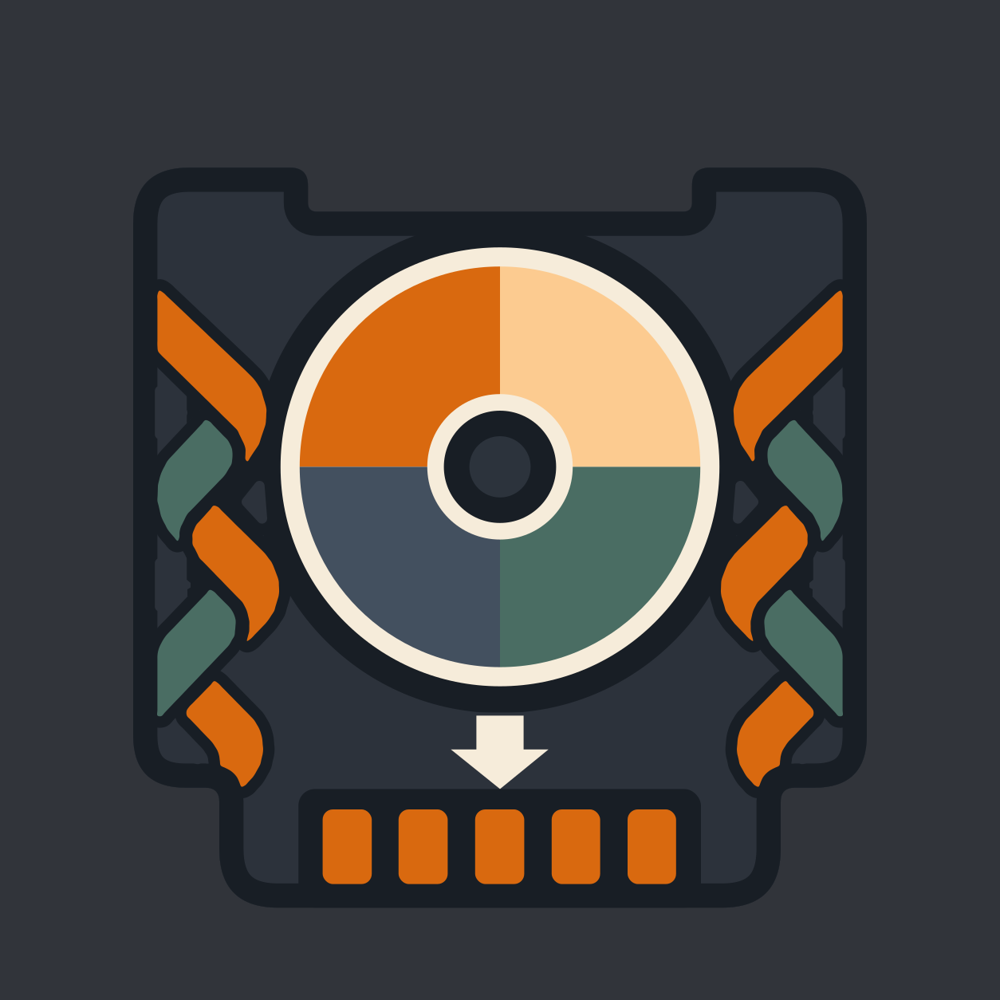

# Icon masters

Source SVGs for the pre-rendered PNGs in `../../src/assets/app/root/`. Each wraps the inner
content of `../../src/assets/app/root/logo.svg` in an opaque `#31343a` background rect plus a
scale/offset transform - regenerate them from `logo.svg` if the logo changes.

<!-- START doctoc -->
## Table of contents

- [Geometry](#geometry)
- [Rendering](#rendering)

<!-- END doctoc -->

## Geometry

The logo is geometrically centered but optically high: its top corners are
square ears while its bottom corners are rounded flares, so the top hits a
circular launcher mask first. Each master therefore nudges the logo DOWN
(`translate(off, off + dy)`), balancing radial reach against Android's
50%-radius circle mask.

| master               | output                       | scale | dy (of 1254) |
| -------------------- | ---------------------------- | ----- | ------------ |
| icon-maskable.svg    | icon-maskable-{192,512}.png  | 0.80  | 48           |
| apple-touch-icon.svg | apple-touch-icon.png (180px) | 0.74  | 44           |

`off = 1254 * (1 - scale) / 2`. dy scales roughly +1 per scale point
(84% is flush against the circle at dy 52; 80% leaves ~13px margin at 512px).

## Rendering

Headless Chrome gives an exact render (magick's SVG delegate does not):

```sh
printf '<!doctype html><style>html,body{margin:0}</style>' > /tmp/i.html
"/Applications/Google Chrome.app/Contents/MacOS/Google Chrome" \
  --headless --disable-gpu --hide-scrollbars \
  --screenshot=icon-maskable-512.png --window-size=512,512 "file:///tmp/i.html"
```

Repeat with 192x192 (and 180x180 for apple-touch-icon.svg), then copy the
PNGs into `../../src/assets/app/root/`.
